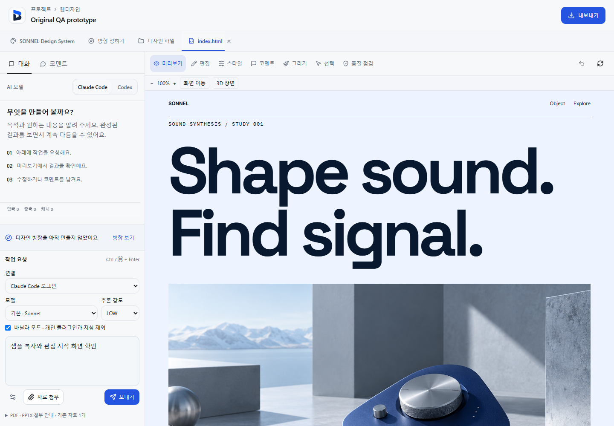
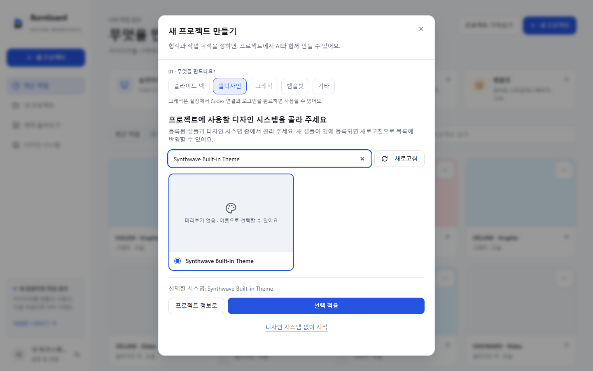
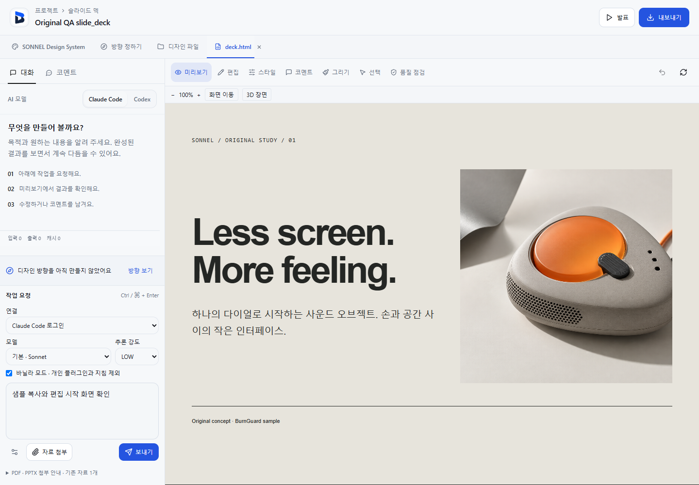
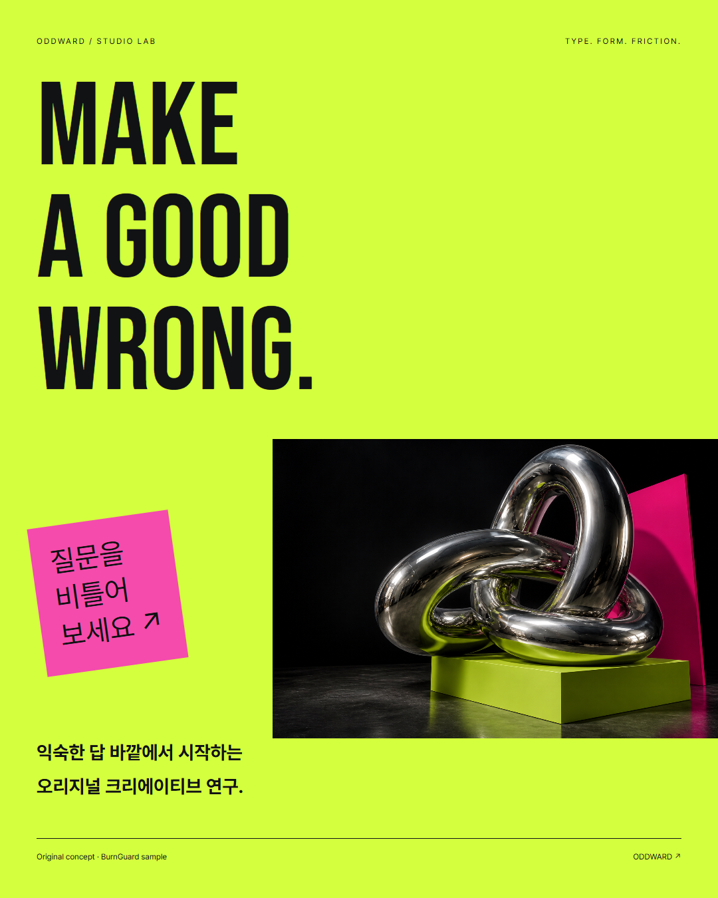

# BurnGuard

**Make websites, slides and graphics with AI. Refine them on canvas. Keep the files.**

BurnGuard is a local design workspace for Windows and macOS. Bring your Claude Code or Codex connection, choose a design system, and work beside a live preview. Your projects and reusable design systems live on your computer; AI requests use your chosen provider.

[Download the app](https://github.com/ashmoonori-afk/BurnGuard/releases/latest) · [Documentation](doc/README.md) · [한국어](README.ko.md) · [简体中文](README.zh-CN.md)



*The actual editor displaying the bundled SONNEL website. Choose a model on the left, inspect the result on the right, and move between preview, editing and comments.*

## Start with a design direction

Choose a format, describe the project and select a registered design system during onboarding. Search the catalogue or refresh it to pick up newly registered systems. You can also start without one.

The bundled catalogue includes **41 themes**, including **31 original themes** with distinct layout and composition rules. The selected system supplies typography, colors, spacing and layout requirements to generation, including compact prompts. Add your own systems from supported files, websites, repositories or Figma sources, then review and publish them for project use.



*Design-system selection in the real application. Systems without a preview remain selectable by name.*

**37 font families** ship with license notices. Bundled fonts use one shared local store, and canvas loads are reused across projects within the app window. New projects reference that store; standalone exports include the font files they need. [Font catalogue](assets/fonts/README.md) · [Design-system format](doc/05-design-system-format.md)

## One workspace, several kinds of output

| Make | Work with | Take away |
|---|---|---|
| Websites | Linked pages, shared styles, images and reusable components | HTML/CSS/JS/assets ZIP, or publish to your Vercel account |
| Slide decks | Slide previews, typography, presentation mode and comments | HTML, PDF or PPTX |
| Graphics | Custom artboard sizes, posters and multi-frame compositions | PNG, PNG bundle or PDF |
| Product detail pages | Long pages with section imagery | Section-aware PNG/JPEG slices |
| Platform pages | Cafe24 Smart Design or Imweb code-widget output | Packages with manual installation guides |



*The same workspace handles a slide deck, with presentation and export controls above the canvas.*

PPTX exports contain a high-resolution image of each slide and its text in speaker notes. Individual elements remain editable in BurnGuard's HTML workspace; they are not exported as editable PowerPoint objects.

## Refine the result where you see it

- **Edit on canvas.** Select elements, adjust size and rotation, change typography and spacing, or work with colors. Saved revisions and undo help you return to an earlier result.
- **Leave a targeted comment.** Pin feedback to a location and send an AI edit request. Hover over the canvas and press **Ctrl+Space** on Windows/Linux or **Control+Option+Space** on macOS for a quick comment.
- **Add source material.** Attach supported PDFs, slide decks, documents, images or text, or import an exported HTML project ZIP. Original attachments are retained separately from published website assets.
- **Review before sharing.** Quality and UX panels identify issues and offer repair actions. Their findings are advisory; review the rendered result before exporting or publishing.

### Images, charts and 3D

Give images a role in the design: a product hero, campaign scene, explanatory illustration or background. BurnGuard includes **21 image treatments** and **38 purpose recipes** across 13 domains. Generation guidance calls for image production where the design needs it; the configured provider must support the requested generation. Graphic generation requires an authenticated Codex connection. [Image production guide](doc/image-production.md)

<p align="center">
  
</p>

*A rendered ODDWARD sample graphic from the local QA evidence. The fictional sample's creative artwork is generated imagery; this is an output preview, not an application screenshot.*

Add area, line, bar, composed, radar, pie, radial or Sankey charts from the **Chart** panel. Paste spreadsheet rows, edit colors and keep portable SVG with its source data in the HTML. The **3D** panel supports bundled Three.js objects and AI scene edits. [Chart guide](doc/charts.md)

Explore **SONNEL**, **FOLIOVER**, **ODDWARD**, **VELUNE** and **HALIDE**. Each original collection includes a website, a six-slide deck, a graphic and a design system. [Sample collections](samples/original/README.md) · [Image recipe gallery](doc/images/image-recipes/README.md)

## Get started

1. **Install.** Download a Windows or macOS package from [GitHub Releases](https://github.com/ashmoonori-afk/BurnGuard/releases/latest). On Windows, use the installer or extract the complete portable ZIP and open `BurnGuard.exe`. On macOS, use the installer or move the portable app into Applications. Packages are currently unsigned.
2. **Explore an example.** Open a bundled project and try the canvas before connecting an AI provider.
3. **Connect your CLI.** Install and authenticate Claude Code or Codex CLI, then choose the connection and model in Settings. **LOW effort and vanilla mode are the defaults.** Vanilla mode excludes personal plugins and instructions while keeping BurnGuard's project context.
4. **Create a project.** Pick a format and design system, add your brief and reference material, then generate and refine.
5. **Export or share.** Download the project files, or use **Share → Prepare current output → Publish publicly** for a website on your Vercel account.

| Requirement | Details |
|---|---|
| Windows desktop | Windows 10/11 x64, .NET Framework 4.8 and Microsoft Edge WebView2 Runtime |
| AI generation | Installed, authenticated `claude` or `codex` CLI and the corresponding provider account |
| Rendering and export | Supported Chrome/Edge or Chromium; availability is shown in Settings |
| Updates | Windows and macOS release feeds; preserve your local profile when replacing a package |

Vercel publishing requires your token and optional team ID. Hosting plans and visitor access follow your Vercel settings. Cafe24 and Imweb packages require manual installation; they have not been validated in a live customer shop.

## Your projects stay local

BurnGuard keeps its database, projects, settings, systems and export cache in `~/.burnguard` (`%USERPROFILE%\.burnguard` on Windows). Keep this profile when upgrading the app.

Generation sends selected context to your configured provider. Imports and publishing can also use the network. The local server binds to loopback, checks launch authority and isolates generated pages in a sandbox. [Security model](doc/01-architecture.md#7-security-and-safety-model)

## Run from source

Use **Bun 1.3.14**, as pinned in CI.

```sh
git clone https://github.com/ashmoonori-afk/BurnGuard.git
cd BurnGuard
bun install --frozen-lockfile
bun run scripts/dev-launcher.ts
```

The launcher opens the frontend at `http://127.0.0.1:5173`; the backend uses `127.0.0.1:14070`. Stop it with Ctrl+C. On Windows, `Start-BurnGuard.bat` launches the native app and builds it when needed; that build requires Bun and the .NET 8 SDK. Use `--rebuild` after source changes.

```sh
bun run typecheck
bun run lint
bun run build:frontend
bun test
```

Run tests from the repository root so the preload provides an isolated temporary profile. Browser QA requires Node.js and Chrome/Edge; Windows runners may need an absolute Bun executable path. [Contributing and native builds](doc/CONTRIBUTING.md)

<details>
<summary>About the screenshots</summary>

The interface captures were selected from the repository's local `.omo/evidence` QA records and copied without retouching. They show seeded examples and test input, not private customer projects or proof of a live provider run. Older captures may differ slightly from the current toolbar.

| README image | Original evidence capture |
|---|---|
| Website workspace | `fonts-2026-09-09/app-created-prototype.png` |
| Design-system picker | `design-system-onboarding-20260914/onboarding-desktop.png` |
| Slide workspace | `updates-samples-2026-09-09/app-created-slide_deck.png` |
| Graphic output | `fonts-2026-09-09/oddward-graphic-quality.png` |

</details>

## Documentation and license

[Documentation index](doc/README.md) · [Architecture](doc/01-architecture.md) · [Design guidance](doc/design-craft.md) · [Installation and updates](doc/13-windows-updates-and-original-samples.md)

BurnGuard is licensed under **Apache-2.0**. See [LICENSE](LICENSE), [NOTICE](NOTICE) and the [image provenance notes](doc/images/README.md).
