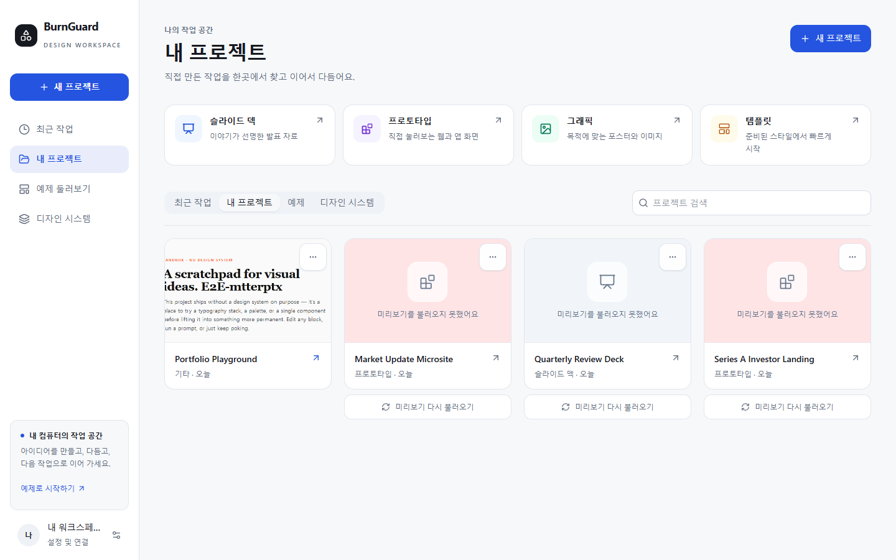
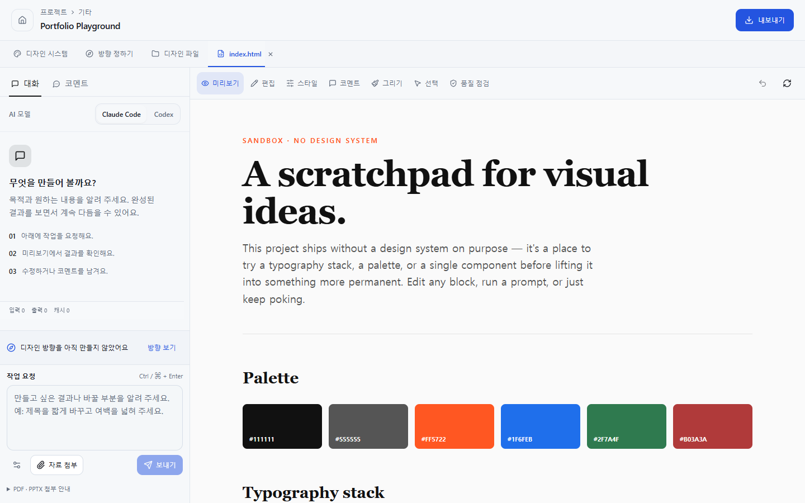
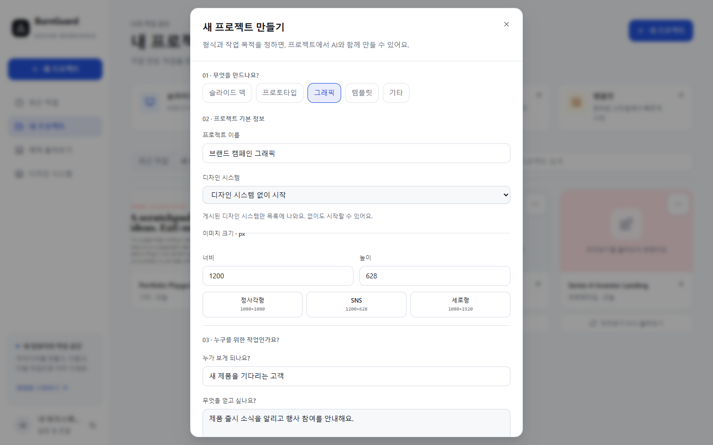

# BurnGuard


**Describe an idea, refine it on canvas, and take the files with you.**

BurnGuard is an AI design workspace that runs on your computer. Connect **Claude Code or Codex CLI** to create slide decks, web designs, and graphics, then refine them through conversation and the canvas. Choose the model and reasoning effort for each request; **LOW and vanilla mode are the defaults**. Projects and design systems are stored locally.

[한국어](README.ko.md) · [Get started](#get-started) · [Workflow](#workflow) · [Development](#development) · [Documentation](doc/README.md)

> The cover is an AI-generated concept illustration. The screenshots below show the actual app using a separate local sample profile.

## One workspace

| What you want to make | What you can do in BurnGuard |
|---|---|
| Presentations | Create a slide deck, review each slide, then present it or export it as PDF or PPTX. |
| Web designs | Set the section count, start from complete landing templates with matching design systems, and edit HTML on canvas. |
| Graphics | Set the canvas dimensions, create a design, and export it as PNG. |
| Consistent designs | Connect a published design system's colors, typography, and rules to a project. |
| Work from existing material | Choose a template or attach PDF/PPTX documents and assign reference roles. |
| Interactive 3D | Add and adjust Three.js objects, or ask AI to create a scene; orbit and zoom in the preview. |

### A home for starting and resuming work

Start a new project by choosing its type. Enter a name, audience, and goal, then expand any additional options you need. Search and reopen recent work, your projects, examples, and design systems from their own lists.



### An editor that keeps the conversation beside the result

See the actual output beside your AI conversation. Choose editing, styles, comments, drawing, or quality checks as needed, and switch between files to review them. On smaller screens, switch between **Workspace (작업 화면)** and **AI conversation (AI 대화)** to give each enough room.



## Get started

### Prerequisites

| Purpose | Required tool |
|---|---|
| Run from source | Bun. The current repository validation environment uses Bun 1.3.13 on Windows. |
| AI generation | An installed and authenticated `claude` or `codex` CLI |
| PDF, PPTX, and PNG rendering and previews | Chromium or a supported Chrome/Edge installation. Check its status in the app settings. |
| Read PDF and PPTX source documents | Python 3 and `pypdf`. Check their status and install the required module from the app settings. |

You can explore the built-in examples and canvas before connecting an AI tool. Generation requires authentication for the selected CLI and is subject to its provider's terms.

Graphic projects require an authenticated Codex connection. Vanilla mode excludes personal plugins and instructions while keeping BurnGuard's project context. Its CLI flags were checked with Codex 0.153.4 and Claude Code 2.1.261; older CLIs may need updating. Turn vanilla mode off explicitly to use personal configuration.

### Run on Windows

```powershell
git clone https://github.com/ashmoonori-afk/BurnGuard.git
cd BurnGuard
bun install --frozen-lockfile
bun run scripts/dev-launcher.ts
```

The launcher waits for the backend to be ready, starts the frontend, and opens a browser. You can also start it with `Start-BurnGuard.bat` in the repository.

- App: **http://127.0.0.1:5173**
- Backend health: **http://127.0.0.1:14070/api/health**
- Stop: press `Ctrl+C` in the running terminal.

If another program is using a default port, identify it before trying again. The launcher does not terminate other processes automatically.

### Build a distributable folder

```powershell
bun run build
```

Run `dist/windows/burnguard-design.exe` to serve the built UI at **http://127.0.0.1:14070**. To distribute the app, copy the **entire `dist/windows` folder**. Its `resources` directory includes the UI, migrations, bundled design assets, Playwright, Node, and their licenses. Check Chromium and Python availability separately.

macOS build scripts are also available, but the latest UI changes have not been directly verified on macOS. See the [build and development guide](doc/CONTRIBUTING.md).

## Workflow

1. **New project** — Choose slides, web design, graphic, or template. Set the brief and section count, and upload source material immediately. Attachments and the brief arrive as an editable conversation draft.
2. **Create with AI** — Select the model and effort, review the draft, then send it. Increase effort explicitly when the task needs more reasoning; LOW does not guarantee a particular response time.
3. **Review the result** — Open generated files and inspect them on canvas. Conversation drafts and attachment roles are restored per session.
4. **Refine directly** — Pan and zoom the canvas, scroll while editing styles, load installed fonts, and adjust 3D objects. Send a saved comment to AI with its file and target context, then follow the result in the conversation. Undo/Redo and quality checks remain available.
5. **Export** — Choose a format supported by the project. Follow progress, cancellation, failure, and expiration states, then download an available result.



## Design systems and settings

In **Design systems (디자인 시스템)**, review imported material, inspect colors, typography, and previews, then publish it. Projects use published systems. URL, Figma, and file imports depend on the supported source formats and authentication requirements.

**Pinterest mood import** accepts up to 12 public pin URLs and creates a reviewable draft from sampled image colors and available metadata. It distinguishes sampled evidence from inferred mood and fallback fonts. Private pins, boards, and shortened links are not supported; unavailable pins are reported individually.

**Settings and connections (설정 및 연결)** brings together your profile, default AI tool, display theme, Chromium, Python, and Figma connection. If one tool's status check fails, you can still edit other settings and retry the failed check separately.

Save or delete a **CommandCode API key** in settings to route supported Claude models through the [CommandCode provider API](https://commandcode.ai/docs/provider). This integration still uses the installed Claude Code CLI. The saved key is never returned by the settings API; real provider execution needs your valid key and account. Local fonts are loaded only when requested, using browser permission or the Windows font list; font files are not uploaded or embedded in exports.

## Data and network use

The default data directory is `~/.burnguard/`, or `%USERPROFILE%\.burnguard\` on Windows.

```text
.burnguard/
├── config.json          # User settings
├── burnguard.db         # Projects, conversations, events, and job state
├── data/
│   ├── projects/        # Project files
│   └── systems/         # Design systems
├── cache/exports/       # Exported results
└── logs/
```

Local storage does not mean all processing happens offline. During AI generation, prompts and selected context are sent to the provider used by your CLI. Web and Figma imports and tool installation also use the network. Check your provider's policies before attaching sensitive material.

The app binds to loopback and checks API launch authority and Host/Origin. The canvas runs in a separate sandbox. Exposing this server directly to the internet is outside the supported deployment scope.

## Development

The Bun monorepo uses the existing React, React Query, Radix, and Tailwind stack, without adding a new state management or design library.

| Path | Responsibility |
|---|---|
| `packages/frontend` | React/Vite UI, conversations, canvas, design systems, and settings |
| `packages/backend` | Hono, SQLite, CLI execution, file recovery, extraction, and exports |
| `packages/shared` | Versioned API and event contracts and parsers |
| `scripts` | Launching, builds, and isolated QA |

```powershell
bun run typecheck
bun run build:frontend
bun run test
bun run test:coverage
bun run lint
node scripts/qa/e2e-smoke.mjs
```

Run tests from the repository root. The preload prepares an isolated temporary profile and a database using the real migrations. Browser QA requires Node.js 22.13 or later, uses a sample profile separate from your work, and does not send external model requests. If you use the npm-provided Windows Bun command shim, pass `--bun <absolute path to bun.exe>` to browser QA. Running browser-heavy checks sequentially is more reliable.

`lint` runs `git diff --check`. Passing tests and meeting the per-file 80% coverage threshold are separate results. The previous review passed all tests but missed the per-file coverage threshold; those results are not reused as validation of the new UI.

## Current scope

- This is a single-user workspace that uses local CLIs. Cloud collaborative editing, hosting, and automatic deployment are outside its scope.
- The research catalog supplies references and limitations for generation. It does not provide a separate research management UI or guarantee the quality of every source. See the [research documentation](doc/research.md).
- External providers, Figma accounts, all user document types, macOS, Narrator, and full accessibility conformance require verification beyond local regression tests.
- Per-file coverage gaps and the exact validation scope are recorded in the [previous review](doc/09-review-remediation-2026-09-08.md), [UI redesign](doc/10-ui-redesign-2026-09-09.md), and [creation and canvas update](doc/11-creation-tools-and-canvas-2026-09-09.md).

## Documentation and license

[Documentation index](doc/README.md) · [Contributing](doc/CONTRIBUTING.md) · [Architecture](doc/01-architecture.md) · [Data model](doc/02-data-model.md) · [Design system format](doc/05-design-system-format.md)

The code is licensed under **Apache-2.0**. See [LICENSE](LICENSE) and [NOTICE](NOTICE) for third-party sources and licenses. The [image notes](doc/images/README.md) describe image generation and the scope of the actual app screenshots.

The generated B mark, palette, and usage rules are documented in the [brand identity guide](doc/brand-identity.md).
