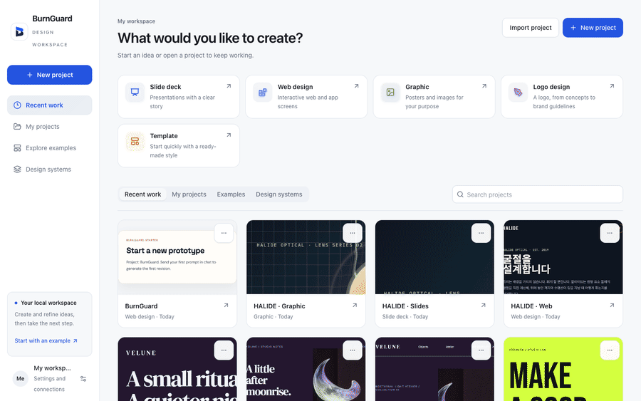
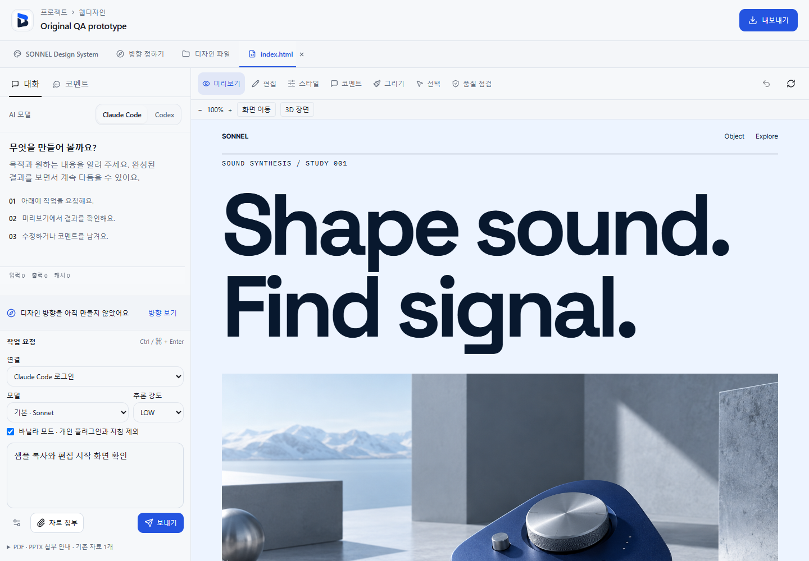
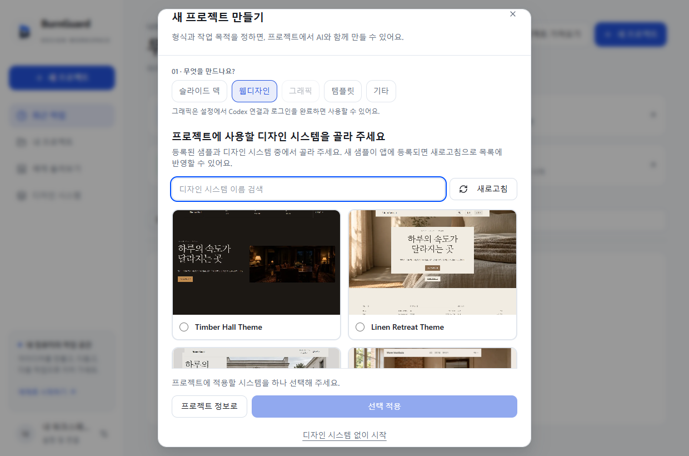
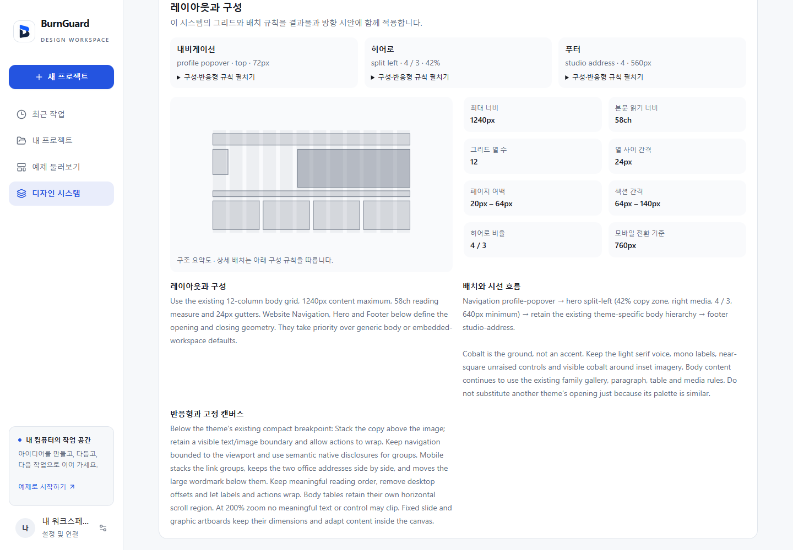
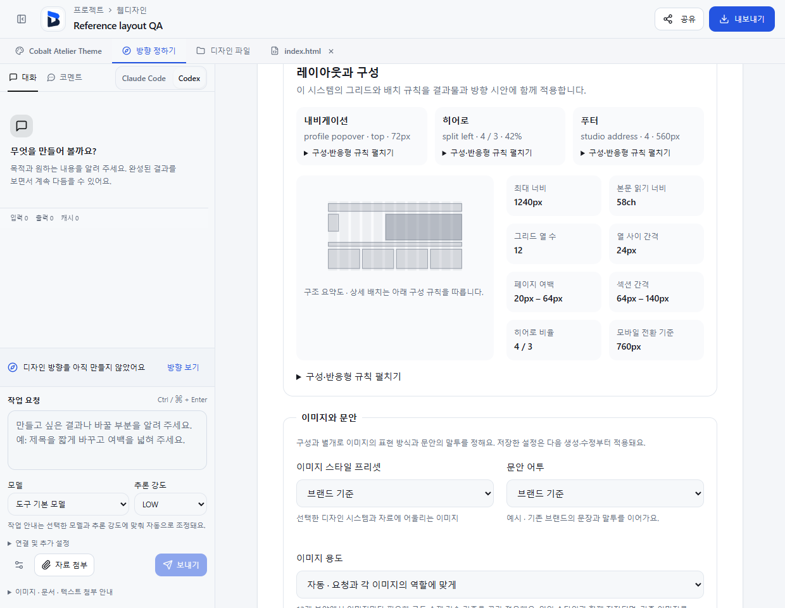
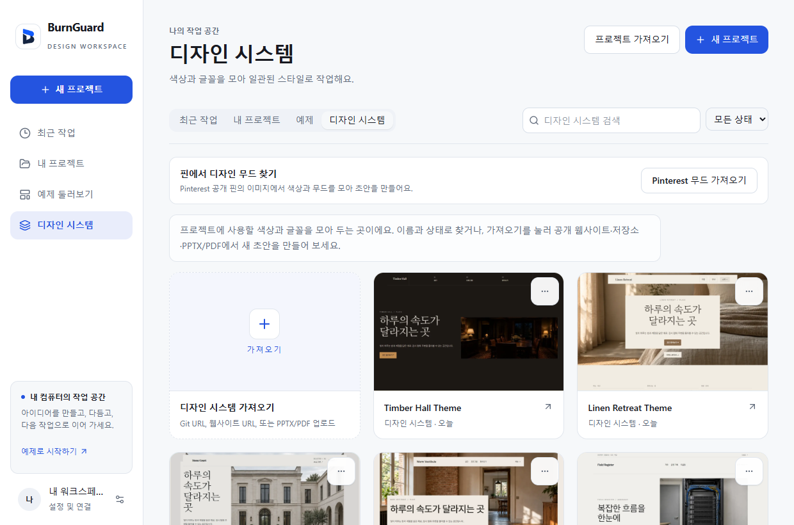
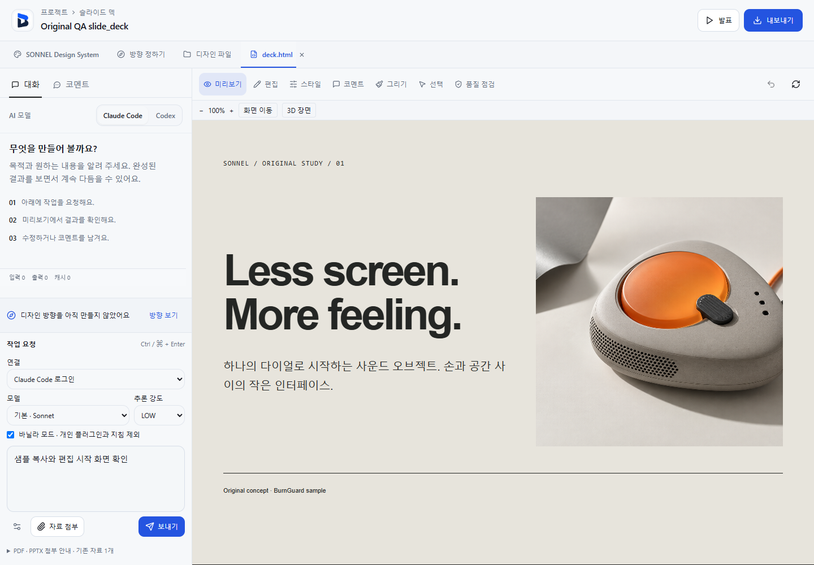
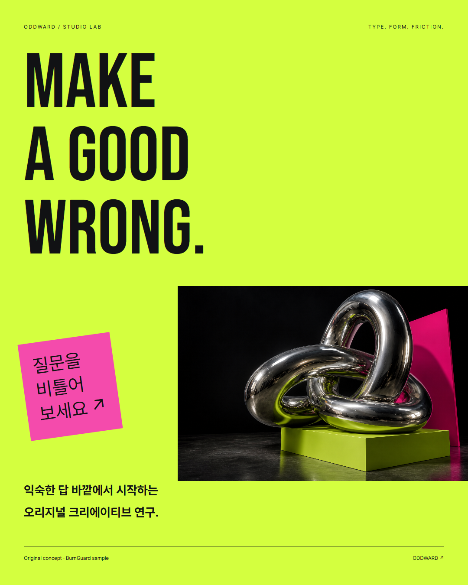

# BurnGuard

**Open-source Claude Design alternative that runs on the Claude Code or Codex you already pay for.**



*Recorded on v0.5.25 with Claude Code (Sonnet, LOW reasoning) and no design system. The five-minute generation is sped up; everything else is real time.*

[](https://github.com/ashmoonori-afk/BurnGuard/releases/latest) [](https://github.com/ashmoonori-afk/BurnGuard/releases) [](LICENSE) [](https://github.com/ashmoonori-afk/BurnGuard/stargazers)

⭐ If BurnGuard saves you time, a star helps others find it.

Make websites, slides and graphics with AI, refine them on canvas and keep the files. BurnGuard is a local design workspace for Windows and macOS. Bring your Claude Code or Codex connection, choose a design system, and work beside a live preview. Your projects and reusable design systems live on your computer; AI requests use your chosen provider.

[Download the app](https://github.com/ashmoonori-afk/BurnGuard/releases/latest) · [Documentation](doc/README.md) · [한국어](README.ko.md) · [简体中文](README.zh-CN.md)

## How it compares

*As of 2026-09-28, from each product's public page or README ([sources](#comparison-sources)).*

| | BurnGuard | Claude Design | OpenDesign |
|---|---|---|---|
| Cost model | Free, Apache-2.0. Generation runs through your own Claude Code or Codex CLI and that provider account | Included in paid Claude plans; uses your plan's usage limits, with optional extra usage | Free, Apache-2.0. Bring your own coding-agent CLI or API key; optional paid OpenDesign Cloud models |
| Where files live | On your computer (`~/.burnguard`) | Claude's hosted workspace; export or save as a folder | Local-first desktop app; Docker self-hosting |
| Design-system rules | 41 bundled themes, each with navigation, hero and footer layout rules; add your own from files, websites, repositories or Figma | Built from your codebase and design files; admins can lock one approved system | `DESIGN.md` design systems, skills and plugins |
| Canvas edit | Select, resize, rotate, typography, spacing and colors on the canvas; pinned comments | Inline comments, direct text edits, generated sliders; drag, resize and align | Iterate with the agent beside a sandboxed preview; comment-mode edits partially shipped (its roadmap) |
| Export formats | HTML ZIP, PDF, PPTX, PNG, PNG bundle, SVG (logos), handoff package, Cafe24 and Imweb packages | PDF, PPTX, standalone HTML, folder; Canva and other connectors; Claude Code handoff | HTML, PDF, PPTX, ZIP, Markdown, MP4 |
| Publish | Publish to your own Vercel account with your token (one click once the token is saved in Settings and the export is verified) | Organization-scoped links; connectors including Vercel | Not documented in its README |
| OS | Windows 10/11 x64; macOS 14+ on Apple silicon | Web and Claude apps, Claude Code | macOS (Apple silicon and Intel), Windows x64; Linux from source |



*The actual editor displaying the bundled SONNEL website. Choose a model on the left, inspect the result on the right, and move between preview, editing and comments.*

## Start with a design direction

Choose a format, describe the project and select a registered design system during onboarding. Search the catalogue or refresh it to pick up newly registered systems. You can also start without one.

The bundled catalogue includes **41 themes**, including **31 original themes**. Each has a distinct navigation, hero and footer combination, with its own placement, proportions and responsive rules alongside typography and colors. These layouts adapt references from Supahero, Navbar Gallery and Footer Design; each theme records its sources. The original sample systems and prompt presets carry layout rules too. Add your own systems from supported files, websites, repositories or Figma sources, then review and publish them for project use. [Explore the 41 reference layouts](<design system themes/>)



*Design-system selection in the real application. Systems without a preview remain selectable by name.*

Open a system's overview to inspect its navigation, hero and footer rules. **Direction setting and generation use the same rules**, including compact prompts: the three direction previews vary message, evidence and action emphasis within the selected system's structure. These are structural summaries; rendered output can contain richer detail. Directions saved before the system was selected or its rules changed can be regenerated from the current system.



*The actual Cobalt Atelier overview. Navigation, hero and footer summaries stay visible; expand a region to read its full rules. Missing bundled rules are supplemented while existing authored rules are preserved.*



*The same layout rules in a real project's direction screen, before generation. This capture shows the configured guidance, not a measured model-quality result.*

Desktop packages include **41 website examples**, **41 generated WebP illustrations** and **41 website thumbnails captured in Chrome**. The design-system library and project onboarding show the thumbnails; each theme's overview has a dedicated, scrollable website preview. Explore editorial sites, shops, workspaces, cultural pages and more in the [website preview gallery](design%20system%20themes/previews/index.html). [Theme token catalogue](design%20system%20themes/catalogue.html)



*The actual design-system library with bundled website thumbnails.*

These examples illustrate the bundled themes' default designs. Existing system preview files take precedence; when they are missing, BurnGuard shows the bundled reference without overwriting edited system files or publication records. In the app, the examples use the shared local font store.

**72 font families** ship with license notices. Bundled fonts use one shared local store, and canvas loads are reused across projects within the app window. New projects reference that store; standalone exports include the font files they need. [Font catalogue](assets/fonts/README.md) · [Design-system format](<design system sample/README.md>)

## One workspace, several kinds of output

| Make | Work with | Take away |
|---|---|---|
| Websites | Linked pages, shared styles, images and reusable components | HTML/CSS/JS/assets ZIP, or publish to your Vercel account |
| Slide decks | Slide previews, typography, presentation mode and comments | HTML, PDF or PPTX |
| Graphics | Custom artboard sizes, posters and multi-frame compositions | PNG, PNG bundle or PDF |
| Logos | Design explorations across multiple rounds, select one as the master | SVG master¹, brand-guidelines PDF or HTML archive |
| Product detail pages | Long pages with section imagery | Section-aware PNG/JPEG slices |
| Platform pages | Cafe24 Smart Design or Imweb code-widget output | Packages with manual installation guides |

¹ SVG master export is available for logo projects only.



*The same workspace handles a slide deck, with presentation and export controls above the canvas.*

PPTX exports contain a high-resolution image of each slide and its text in speaker notes. Individual elements remain editable in BurnGuard's HTML workspace; they are not exported as editable PowerPoint objects.

## Refine the result where you see it

- **Edit on canvas.** Select elements, adjust size and rotation, change typography and spacing, or work with colors. Saved revisions and undo help you return to an earlier result.
- **Leave a targeted comment.** Pin feedback to content and send an AI edit request. Pins stay attached while you scroll; click a saved pin to reopen its comment. Hover over the canvas and press **Ctrl+Space** on Windows/Linux or **Control+Option+Space** on macOS for a quick comment.
- **Add source material.** Attach supported PDFs, slide decks, documents, images or text, or import an exported HTML project ZIP. Original attachments are retained separately from published website assets.
- **Review before sharing.** Quality and UX panels identify issues and offer repair actions. Their findings are advisory; review the rendered result before exporting or publishing.

### Images, charts and 3D

Give images a role in the design: a product hero, campaign scene, explanatory illustration or background. BurnGuard includes **21 image treatments** and **38 purpose recipes** across 13 domains. Generated images are **photorealistic by default**: abstract imagery is prohibited unless you ask for it, image prompts are written as a photographer's brief, and generated-art signatures such as plastic skin, glowing backdrops and garbled lettering are rejected at inspection. Non-photographic treatments apply only when you select or request them. Generation guidance calls for image production where the design needs it; the configured provider must support the requested generation. Graphic generation requires an authenticated Codex connection. [Image production guide](doc/image-production.md)

<p align="center">
  
</p>

*A rendered ODDWARD sample graphic from the local QA evidence. The fictional sample's creative artwork is generated imagery; this is an output preview, not an application screenshot.*

Add area, line, bar, composed, radar, pie, radial or Sankey charts from the **Chart** panel. Paste spreadsheet rows, edit colors and keep portable SVG with its source data in the HTML. The **3D** panel supports bundled Three.js objects and AI scene edits. [Chart guide](doc/charts.md)

Explore **SONNEL**, **FOLIOVER**, **ODDWARD**, **VELUNE** and **HALIDE**. Each original collection includes a website, a six-slide deck, a graphic and a design system. [Sample collections](samples/original/README.md) · [Image recipe gallery](doc/images/image-recipes/README.md)

## Get started

1. **Install.** Download a Windows or macOS package from [GitHub Releases](https://github.com/ashmoonori-afk/BurnGuard/releases/latest). On Windows, use the installer or extract the complete portable ZIP and open `BurnGuard.exe`. On macOS, use the installer or move the portable app into Applications. Packages are currently unsigned.
   - **On macOS:** The first launch is blocked by Gatekeeper. Try opening the app once, then go to **System Settings > Privacy & Security > Open Anyway**. Alternatively, in Terminal run: `xattr -dr com.apple.quarantine "/Applications/BurnGuard.app"`. Note: On macOS 15+, Control-click to open no longer bypasses this; use the System Settings path instead.
   - **On Windows:** SmartScreen may show "Windows protected your PC" for the unsigned Setup.exe or portable .exe. Click **More info**, then **Run anyway**.
2. **Explore an example.** Open a bundled project and try the canvas before connecting an AI provider.
3. **Connect your CLI.** Install and authenticate Claude Code or Codex CLI, then choose the connection and model in Settings. **Medium effort and vanilla mode are the defaults.** Vanilla mode excludes personal plugins and instructions while keeping BurnGuard's project context.
4. **Create a project.** Pick a format and design system, add your brief and reference material, then generate and refine.
5. **Export or share.** Download the project files, or use **Share → Prepare current output → Publish publicly** for a website on your Vercel account.

| Requirement | Details |
|---|---|
| Windows desktop | Windows 10/11 x64, .NET Framework 4.8 and Microsoft Edge WebView2 Runtime |
| AI generation | Installed, authenticated `claude` or `codex` CLI and the corresponding provider account |
| Rendering and export | Supported Chrome/Edge or Chromium; availability is shown in Settings |
| Updates | Windows and macOS release feeds; preserve your local profile when replacing a package |

Vercel publishing requires your token and optional team ID. A pasted token stays in memory for that publish; a token saved in Settings is kept only in this computer's local config file. Hosting plans and visitor access follow your Vercel settings. Cafe24 and Imweb packages require manual installation; they have not been validated in a live customer shop.

## Your projects stay local

BurnGuard keeps its database, projects, settings, systems and export cache in `~/.burnguard` (`%USERPROFILE%\.burnguard` on Windows). Keep this profile when upgrading the app.

Generation sends selected context to your configured provider. Imports and publishing can also use the network. The local server binds to loopback, checks launch authority and isolates generated pages in a sandbox. [Security model](doc/01-architecture.md#7-security-and-safety-model)

## Run from source

Use **Bun 1.3.14**, as pinned in CI.

```sh
git clone https://github.com/ashmoonori-afk/BurnGuard.git
cd BurnGuard
bun install --frozen-lockfile
bun run scripts/dev-launcher.ts
```

The launcher opens the frontend at `http://127.0.0.1:5173`; the backend uses `127.0.0.1:14070`. Stop it with Ctrl+C. On Windows, `Start-BurnGuard.bat` is a source-build launcher for development (requires Bun and the .NET 8 SDK); normal users should download the release installer from GitHub Releases instead. Use `--rebuild` after source changes.

To inspect the repository's theme examples, open `design system themes/previews/index.html` in a browser. The pages use bundled local fonts and images. After editing theme tokens, rebuild the token catalogue and website previews:

```sh
bun run catalogue
bun run previews
```

`previews` rebuilds the HTML and reuses the existing illustrations; it does not call an image provider. To refresh the committed website thumbnails afterward, optionally run `bun run previews:thumbnails` with Node.js and Chrome installed. It captures the actual pages in Chrome.

```sh
bun run typecheck
bun run lint
bun run build:frontend
bun test
```

Run tests from the repository root so the preload provides an isolated temporary profile. Browser QA requires Node.js and Chrome/Edge; Windows runners may need an absolute Bun executable path. [Contributing and native builds](doc/CONTRIBUTING.md)

<details>
<summary>About the screenshots</summary>

The interface captures were selected from the repository's local `.omo/evidence` QA records and copied without retouching. They show seeded examples and test input, not private customer projects or proof of a live provider run. Older captures may differ slightly from the current toolbar.

| README image | Original evidence capture |
|---|---|
| Website workspace | `fonts-2026-09-09/app-created-prototype.png` |
| Design-system picker | `reference-layout-app/selected/onboarding.png` |
| Design-system library | `reference-layout-app/selected/list.png` |
| Layout overview | `reference-layout-app/selected/overview-desktop.png` |
| Layout direction | `reference-layout-app/selected/direction-desktop.png` |
| Slide workspace | `updates-samples-2026-09-09/app-created-slide_deck.png` |
| Graphic output | `fonts-2026-09-09/oddward-graphic-quality.png` |

</details>

## Changelog

### 0.5.28

- A new website project built from an extracted design system now starts from class-based page skeletons, keeps the extracted hero image, and uses readable colours for buttons, subtitles and footer text. Pages you have already edited are never replaced by the starter.
- The quality review compares each section with the reference screenshots and crops the weakest sections, so a repair can fix one section at a time. A block-outline image is stored next to each reference screenshot.
- Website extraction is more accurate: subheadings, brand names, colour tokens and hero images are measured more reliably, fetched SVG images are cleaned, stylesheet redirects must stay on the same site, and the reason is recorded when layout measurement was not possible.
- Send is disabled with a reason and a Settings link when no AI tool is installed. A stopped or failed turn now always shows as stopped or failed, and a message sent while another one is running is refused cleanly instead of leaving a half-recorded turn.
- When BurnGuard restarts in the background, the open window says so and offers Reload. The workspace, canvas tools and Export stay usable at phone width.
- Reasoning effort defaults to medium where the model offers it, and the Claude, Gemini and preset model lists use the current official model IDs.
- The canvas loads only the fonts a page uses and shows a rendering state until the page has painted. The Style side editor keeps the values you typed.
- Exports handle very large or unusual project files much faster and more safely, keep macOS file names with accented characters, and encode download file names correctly.
- Error messages no longer show private file paths or raw system error text, Settings errors explain how to recover, and Korean and Chinese copy is completed.
- The macOS app follows the same desktop rules as the Windows app, and update checks order pre-release versions correctly.

### 0.5.27

- Projects can be exported as portable `.burnguard-project` bundles and restored on another computer. Saved provider and access tokens and the local configuration are left out, and a restore always creates a new project.
- The handoff export adds a machine-readable manifest, `HANDOFF.md` and a prompt for coding CLIs, with copyable commands to continue in Claude Code or Codex.
- Settings > Runtime diagnostics lists each CLI connection with its version and capabilities and the stage where recent generations stopped; a failed or interrupted project can resume from the files already saved.
- Visual-quality guidance now covers websites, decks, graphics, logos and diagrams. The Quality panel adds advisory checks for separator dashes, placeholder copy, eyebrow labels, repeated or wrapped primary calls to action, accent and corner-radius counts and repeated adjacent sections, and rendered journey checks for websites: links that lead nowhere, mobile navigation that scrolls sideways, invisible keyboard focus and layout shift while loading.
- GIF attachments are accepted and images whose metadata embeds SVG text now decode. WebP files are validated before decoding, and colour sampling of untrusted images runs in a separate process.
- Generate two to four visual alternatives of a design, compare them side by side, promote one and delete the rest.
- PDF, PNG, PNG ZIP and PPTX exports show a per-page similarity score against the canvas. The check warns and never blocks the download.
- A Figma JSON export (with optional frame images) can be imported as an immutable reference matched to your design-system tokens. No Figma account token is needed.
- Website design systems are extracted page by page (navigation, footer and sitemap, respecting robots.txt), with measured layout, page colours, font roles, asset usage rules and asset prompts. With Chromium, up to four source pages are rendered offline and measured at desktop and mobile width, and reference screenshots of those pages are kept with the system.
- Website generation with an extracted system receives the measured values as hard constraints, a starter stylesheet and page skeletons, the reference screenshots as visual targets and one explicit precedence; the review checks the page against the measured layout and repairs it once.
- Generation guidance follows a capability profile per model family (claude-frontier, gpt-image, standard). With Claude Opus or Sonnet, BurnGuard designs a CSS and SVG logo from your tokens under seven construction rules when none is supplied, and finds openly licensed photos, illustrations and icons on Openverse and Iconify (no keys needed) instead of generating images, saving each file with its source and licence. GPT models on Codex keep generating their own images. Web search can be turned off in Settings, and the model picker recommends medium effort or higher.
- Generation and repair prompts carry evidence rules: visual claims only from rendered evidence, checks that did not run reported as unverified, and no unmeasured numbers.
- On first run the app follows your system language (Korean, Simplified Chinese, otherwise English); a language picked in Settings always wins. After your first successful export or publish the app asks once for a GitHub star; nothing is sent anywhere.

### 0.5.26

- Publishing a web project to Vercel adds a small "Made with BurnGuard" badge to the published site only; downloaded ZIP exports are unchanged. The badge can be turned off in Settings or per publish.
- A Vercel token can be saved on this computer, so publishing becomes a single click. Settings only show whether a token is saved, never the token itself.
- The READMEs open with a recorded demo of a one-line prompt becoming a landing page.
- Hidden `<template>` and `<noscript>` markup in untrusted design-system sources is validated once per container and rejected when nested more than eight levels deep, so crafted markup can no longer stall the backend.
- The macOS release smoke test finds the canvas Edit control by its icon instead of by toolbar position, matching the toolbar that dropped the Select mode in 0.5.25.

### 0.5.25

- Generation turns commit even when the rendered design check cannot run (Chromium missing or a large site timing out); the chat shows a "review incomplete" badge instead of refusing the turn. Must-fix findings block a turn only in pages the turn changed, and a turn that edits shared CSS, scripts or images is checked across every page.
- The Quality panel reports checks that do not apply to decks and fixed-size graphics as not applicable, measures contrast on plain gradients, treats monospace text as its own font role, scans linked stylesheets for hard-coded colours, and flags remote fonts, images and frames that exports cannot fetch.
- The design brief carries the app language, and UX-review findings, quality and platform fix requests, direction previews and every app-built AI request are shown in Korean, English or Chinese; error messages exist for every server error code.
- The prompt harness reconciles contradictory rules (charts, palettes, breakpoints, social proof, map embeds, PowerShell on Windows only), adds Hangul typography rules, stages the Lucide icon reference inside each project, gates the 3D and chart contracts by request, ships the complete design-system token block and trims pinned rules in compact mode.
- Canvas: the Edit panel edits image sources and link targets, resolved comments can be reopened, a new comment opens its editor, Ctrl/⌘+Z undoes style tweaks, colour swatches come from the page's own tokens, every bundled font is listed, and the duplicate Select mode is gone.
- Home and settings: dark mode applies on every screen, the language saves on click, backend detection failures show a retry, the creation draft clears after success, and search covers all projects.
- Website import strips scripts and forms instead of rejecting the page, records media-query context on extracted tokens and emits the canonical token contract; starter templates declare `--page-background`.

### 0.5.24

- New projects and seeded samples load in the canvas, live preview and Present again; the bundled font set had outgrown the canvas font limit.
- PDF and PNG ZIP exports keep authored grid/flex layouts and page backgrounds, wait for lazy-loaded images, and export seeded sample graphics as artboard PDFs. Decks too large for PDF are refused before rendering with a clear reason.
- Cafe24 and Imweb packages accept ordinary links, include every page and the assets only subpages use, keep footer scripts working, ship font licenses, and no longer need Chromium.
- Exports include only the bundled fonts the document uses, ZIP files carry local timestamps, and deleted projects no longer leave cached exports behind.
- Chat reports whether a turn's work actually reached the project, including failed deck reviews and repairs; attached source pages map one-to-one to slides when requested.
- macOS app: finds CLIs and Python installed with Homebrew, in `~/.local/bin`, or through npm under nvm, Volta, fnm or a custom npm prefix (it reads your login-shell PATH), opens external links in the browser, supports standard ⌘C/⌘V/⌘Q shortcuts, replaces an existing download, and waits for the local server to stop before quitting.
- Windows app: stays open on recoverable WebView2 process failures and lists installed fonts. Linux source runs list installed fonts, and one backend now owns each profile on macOS and Linux.
- Settings are split into a shared profile and device-local credentials and policy.

### 0.5.23

- Logo projects show Codex image outputs as they arrive, keep candidate bytes verbatim, audit text per artboard and report clearer failure stages.
- Windows owns the backend's process trees with job objects, quotes batch provider arguments safely and routes native downloads by filename.
- Release packaging verifies native canvas, persistence and exports on Windows and macOS before a draft is prepared.

### 0.5.22

- Add logo-design projects with exploration rounds, a selected SVG master and brand-guideline deliverables.
- macOS: working sandboxed canvases, native export downloads, installed font listing and an app-owned Python environment for PDF dependencies.
- Security fixes: PNG decoded-size checks before decompression, SVG revalidation before design-system promotion and stricter POSIX package permissions.
- 0.5.20 and 0.5.21 were not publicly released.

### 0.5.19

- Recover verified legacy attachment-only artifact revisions during startup without replacing project files or uploaded originals.
- Normalize Windows line endings when reading design-system surface rules.
- Fix Windows browser-test startup and isolate provider/render fixtures; include legacy recovery checks in Windows release packaging.

### 0.5.18

- Fit oversized slide content to the artboard as content and images load.
- Validate actual slide content, slide counts, runtime and local images before marking generation complete; continue unfinished output instead of accepting placeholders.
- Default generated imagery to photorealistic subjects and avoid abstract decorative images.
- Keep historical specifications 04–23 and reference notes local; simplify the public documentation index.

### 0.5.17

- Show slide or website thumbnails for the selected project format.
- Preserve generated HTML and assets when generation is stopped, and restore the previous entrypoint if it was removed mid-write.
- Pin project design rules, audit rendered output and include review evidence in handoff exports.

[All releases](https://github.com/ashmoonori-afk/BurnGuard/releases)

## Documentation and license

[Documentation index](doc/README.md) · [Architecture](doc/01-architecture.md) · [Design guidance](doc/design-craft.md) · [Installation and updates](https://github.com/ashmoonori-afk/BurnGuard/releases/latest)

BurnGuard is licensed under **Apache-2.0**. See [LICENSE](LICENSE), [NOTICE](NOTICE) and the [image provenance notes](doc/images/README.md).

### Comparison sources

Checked on 2026-09-28. Claude Design: [product page](https://claude.com/product/design) and [launch announcement](https://www.anthropic.com/news/claude-design-anthropic-labs). OpenDesign: [nexu-io/open-design README](https://github.com/nexu-io/open-design). BurnGuard: this README and [`scripts/build-mac.ts`](scripts/build-mac.ts) (macOS target). Product details change; open an issue if a row is out of date.
