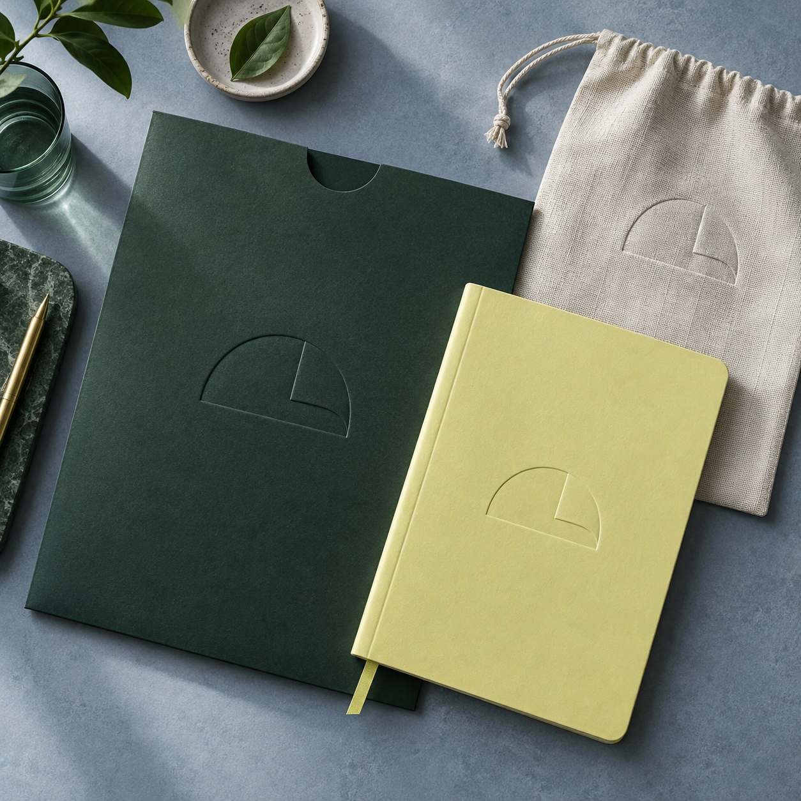
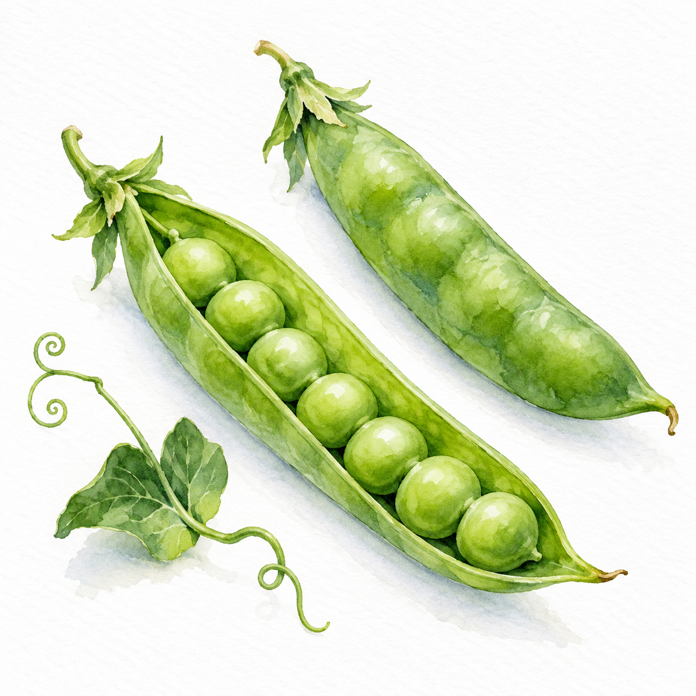
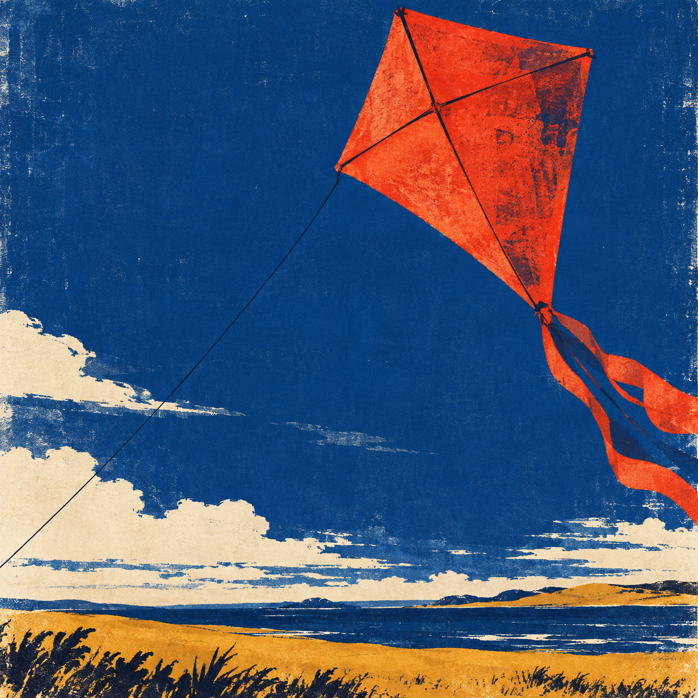
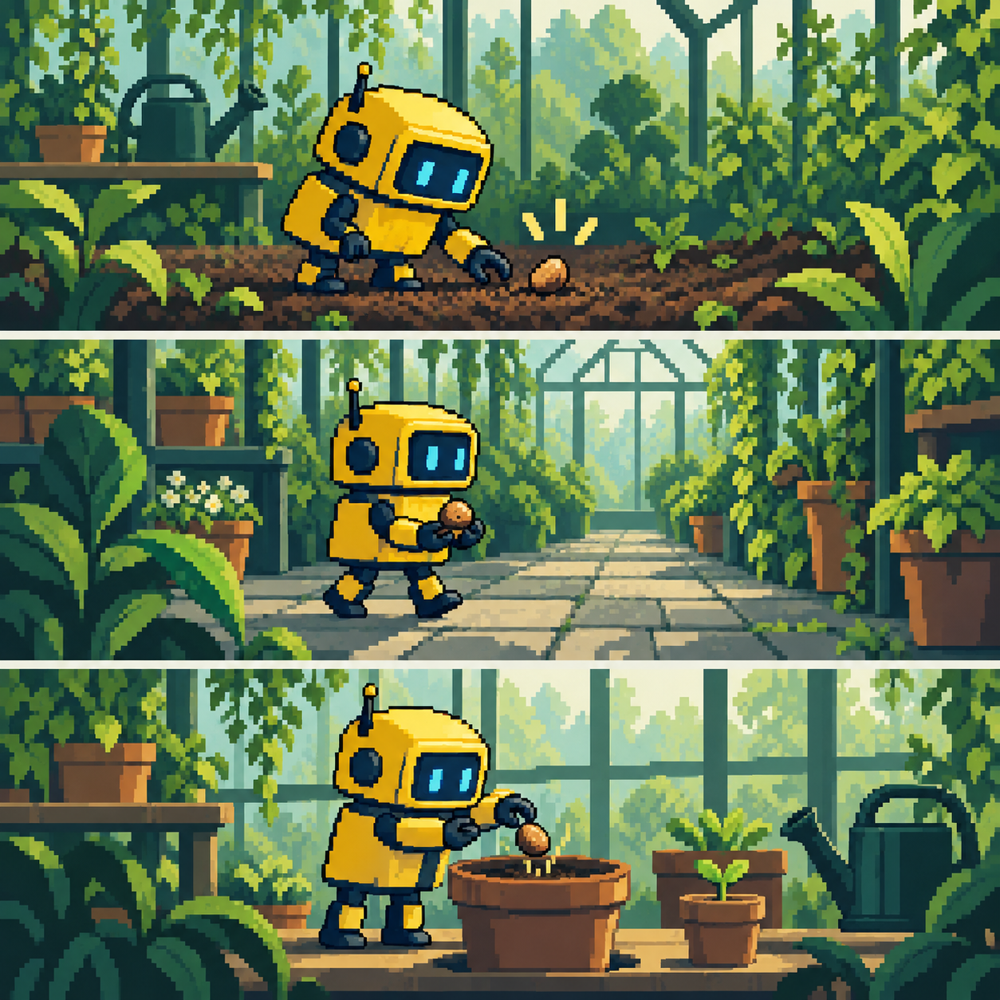

# BurnGuard

**说出想法，在画布上打磨，把文件带走。**

BurnGuard 是一个用于制作幻灯片、网站和平面作品的本地 AI 工作台，提供 Windows 和 macOS 原生应用。连接 Claude Code 或 Codex CLI，选择模型，在实时预览旁边完成工作。**默认使用 LOW 推理强度和原味模式。** 项目、附件和设计系统保存在你的电脑上，生成请求发送给你选定的服务商。

[English](README.md) · [한국어](README.ko.md) · [下载](https://github.com/ashmoonori-afk/BurnGuard/releases/latest) · [快速开始](#快速开始) · [文档](doc/README.md)

> 本文档描述当前源码分支。已发布的桌面版可能只包含较早的功能集。封面为生成图片，工作区截图来自单独的示例配置。

## 能做什么

| 格式 | 工作流与产出 |
|---|---|
| 幻灯片 | 生成和编辑幻灯片，检查文案和排版，演示，或导出 HTML、PDF 和 PPTX。 |
| 网站 | 创建共享设计令牌、各页独立布局的多页站点。导出 HTML/CSS/JS/资源 ZIP，或发布到你的 Vercel 账户。 |
| 平面作品 | 设定画板尺寸，制作海报或多帧套图，导出 PNG、PNG 合集或 PDF。 |
| 商品详情页 | 制作带分区配图的长页面，按分区边界导出 PNG/JPEG 切片。 |
| 平台页面 | 导出 Cafe24 智能设计或 Imweb 代码组件包，附安装指南。安装需手动完成。 |
| 数据图表 | 创建面积图、折线图、柱状图、组合图、雷达图、饼图、径向图和桑基图。编辑数据、主题和颜色；HTML 中保留可移植的 SVG 和源数据。 |
| 3D 场景 | 添加并调整内置的 Three.js 对象，或请 AI 修改场景。 |

**导出限制：** HTML 和 PDF 保留渲染后的幻灯片设计。PPTX 把每页完整幻灯片保存为高分辨率图片，并把文字放进演讲者备注。单个元素在 HTML 工作区中编辑，不是 PowerPoint 对象。外部 API 和服务器功能仍需各自的服务。Cafe24/Imweb 组件包尚未在真实客户店铺中验证。

## 快速开始

### 桌面应用

从 [GitHub Releases](https://github.com/ashmoonori-afk/BurnGuard/releases/latest) 下载安装包。Windows 上运行安装程序，或解压便携版 ZIP 后打开 `BurnGuard.exe`。macOS 安装包未签名。两个桌面外壳共用同一个本地引擎，都支持基于发布源的更新；参见[安装、打包与更新指南](doc/13-windows-updates-and-original-samples.md)。

| 功能 | 要求 |
|---|---|
| Windows 桌面版 | Windows 10/11 x64、.NET Framework 4.8 和 Microsoft Edge WebView2 Runtime |
| AI 生成 | 已安装并完成登录的 `claude` 或 `codex` CLI，以及你的服务商账户 |
| 平面作品生成 | 已登录的 Codex 连接；新的创意图片使用 Codex 图片生成 |
| 预览与导出渲染 | 受支持的 Chrome/Edge 或 Chromium；在设置中查看状态 |
| 读取附件 | PDF、PPTX、DOCX 和受支持的图片；文档提取工具的要求显示在设置中 |

连接 AI 之前也可以浏览示例并编辑画布。扫描版 PDF 会保留原文件，但不保证自动 OCR。原味模式排除个人插件和指令，同时保留 BurnGuard 的项目上下文。CommandCode 路由使用在设置中输入的密钥，仍然需要 Claude Code CLI。

设置中还有两项值得了解：

- **界面语言**（设置 > 外观）：韩语、英语或简体中文。切换立即生效，只影响应用界面，并作为本地偏好保存；用户输入、AI 回复、生成结果、项目和文件名都不会被翻译。韩语仍是首次启动的默认语言。
- **Gemini、DeepSeek、Grok 连接**：目前只能保存 API 密钥。这些连接尚未接入生成，保存了密钥也不代表已通过认证或已连通。实际生成仍依赖 Claude Code 或 Codex CLI。

### 从源码运行

```powershell
git clone https://github.com/ashmoonori-afk/BurnGuard.git
cd BurnGuard
bun install --frozen-lockfile
bun run scripts/dev-launcher.ts
```

请使用 CI 固定的 Bun 1.3.14。启动器在 `http://127.0.0.1:5173` 打开前端，后端绑定到 `127.0.0.1:14070`。按 Ctrl+C 停止。若端口被占用，先确认占用的进程，再启动新实例。

Windows 上可用 `Start-BurnGuard.bat` 打开原生应用，首次启动时会自动构建；该构建需要 Bun 和 .NET 8 SDK。修改源码后请运行 `Start-BurnGuard.bat --rebuild`。[开发与原生构建](doc/CONTRIBUTING.md)。

## 在结果旁边工作

1. **开始或导入。** 选择格式/模板并上传素材，或导入已导出的 HTML 项目 ZIP。导入时会自动读取现有 HTML/CSS 的有限清单，并把受支持的文档提取到下一次 AI 上下文中。附件原件保存在项目的 `docs/attachments` 下，发布网站时会被排除。
2. **设定方向。** 从 21 种图片表现风格和横跨 13 个领域的 38 条用途配方中选择，或让每张图片按自身角色自动匹配配方。设定文案语气、模型和推理强度。[图片制作指南](doc/image-production.md)。
3. **生成。** 请求运行时，在画布上跟踪变化。回来时，会话草稿和素材附件仍然可用。
4. **打磨。** 选中元素即可缩放或旋转。字体和间距用高级面板，颜色用调色板，定向的 AI 修改用评论。使用平移控件移动画布，按 Ctrl/Cmd + 滚轮缩放。在已加载的画布上按 Control+Space，评论编辑器会直接在指针旁边打开，不切换画布模式；按 Escape 关闭并保存草稿。
5. **审查并导出。** 质量和 UX 检查会给出建议，并提供 AI 修复操作。通过与否不会阻止导出或发布；文件安全和请求权限检查仍然生效。

在对话输入框中直接粘贴剪贴板图片，即可作为附件加入；粘贴文字不受影响。


### 图表

打开 HTML 文件，在画布缩放/3D 控件旁选择**图表**。从八种类型中选一种，用你的数据替换明确标出的示例数据，然后保存。可以从电子表格粘贴制表符分隔的行：第一行是类别和系列名称，后面每行是数值。桑基图使用来源、目标和数值三列。

- 用已保存图表选择器编辑文件中的任意图表。保存以当前文件版本为准，支持多步撤销。在工作区按 Ctrl/Cmd+Z，或在保存历史中选择一个保留的项目版本。文本框保留原生撤销；绘图有自己的本地历史。
- 选择主题、来源、单位和颜色；在高级面板中调整尺寸。组合图允许每个系列分别使用柱、线或面积。
- 请 AI 在目标页面/幻灯片位置创建图表，或先保存一个，再从图表面板发送布局/数据请求。
- 图表保留 JSON 数据、内联 SVG、原生悬停提示和可访问的数据表。HTML 无需图表脚本或 CDN 即可显示。PNG/PDF 捕获的是渲染后的 SVG，不是可编辑的数据图表格式。

渲染器为原创实现，没有额外的图表库依赖。[图表数据契约、限制与示例](doc/charts.md)。

### 设计系统与示例

**21 个原创图片示例覆盖全部视觉风格和 13 个用途领域。** 每个示例把一种风格与图片的用途搭配起来；它们是生成的创意示例，不是应用截图。[完整画廊与精确提示词](doc/images/image-recipes/README.md)。

| 品牌 · 识别 | 水彩 · 学习 | 印刷 · 活动 |
|---|---|---|
|  |  |  |
| 黏土 · 收藏品 | 闪光 · 运动 | 像素 · 连续场景 |
|  |  |  |

可从 **SONNEL**（触感音响）、**FOLIOVER**（材质日志）、**ODDWARD**（实验工作室）或 **VELUNE**（雕塑灯具）开始。每套原创合集都包含网站、六页幻灯片、平面作品和设计系统。[浏览合集](samples/original/README.md)。

本地打包了 37 个字体家族：36 个 Google Fonts 家族加上 Pretendard，各自附带许可证声明。样式面板也可以按需加载系统已安装的字体；本地字体文件不会自动嵌入导出结果。[字体目录](assets/fonts/README.md)。

把受支持的文件、URL 或 Figma 来源导入设计系统。Pinterest 情绪板导入最多接受 12 个公开 Pin 链接，并区分采样得到的颜色与推断的情绪和备用字体。在项目中使用之前，先审查再发布该系统。

### 分享网站

选择**分享 → 准备当前产出**，输入 Vercel 令牌和可选的团队 ID，再选择**公开发布**。部署状态变为 READY 后复制链接。质量检查结果仅供参考。令牌只保存在内存中，对话框关闭或部署就绪后即清除。托管费用、套餐资格和访客访问权限取决于你的 Vercel 账户设置；发布前请在 Vercel 中确认。

## 本地数据与安全

默认配置目录是 `~/.burnguard`（Windows 上为 `%USERPROFILE%\.burnguard`），包含 SQLite 数据库、项目、设计系统、设置和导出缓存。替换应用包时不要删除它。

本地存储不等于离线生成：选定的上下文会发送给你在 CLI 中配置的服务商。导入和发布也会使用网络。服务器绑定到回环地址，校验启动能力和 Host/Origin，并把生成的页面隔离在沙箱中。不要把本地服务器暴露到互联网。[安全模型](doc/01-architecture.md#7-security-and-safety-model)。

## 开发

| 包 | 职责 |
|---|---|
| `packages/frontend` | React 18/Vite 界面、对话、画布和设置 |
| `packages/backend` | Bun/Hono、SQLite、生成、持久化文件和导出 |
| `packages/shared` | 版本化契约、校验和可移植的图表渲染 |
| `packages/desktop-windows` | WinForms/WebView2 外壳与更新 |
| `packages/desktop-mac` | AppKit/WKWebView 外壳与更新 |

```powershell
bun run typecheck
bun run lint
bun run build:frontend
bun test
# 聚焦的图表校验与独立的浏览器检查：
bun test packages/backend/tests/charts.test.ts
node scripts/qa/e2e-smoke.mjs --only creation-canvas-charts
```

请在仓库根目录运行测试，这样预加载脚本才会创建隔离的临时配置目录。浏览器 QA 需要 Node.js 22.13+ 和 Chrome/Edge；Windows 上如有需要可传入 `--bun <bun.exe 的绝对路径>`。它使用自有的固定配置，不会向真实服务商发送请求。覆盖率（`bun run test:coverage`）是独立于测试通过的另一道门槛。每次发布前，用 Daybreak 审查最终源码和安装包，并解决阻断级安全问题。

## 文档与许可证

[文档索引](doc/README.md) · [架构](doc/01-architecture.md) · [设计系统](doc/05-design-system-format.md) · [生成指引](doc/design-craft.md) · [品牌识别](doc/brand-identity.md)

BurnGuard 采用 **Apache-2.0** 许可证。第三方声明见 [LICENSE](LICENSE) 和 [NOTICE](NOTICE)，图片和截图来源见[图片说明](doc/images/README.md)。
