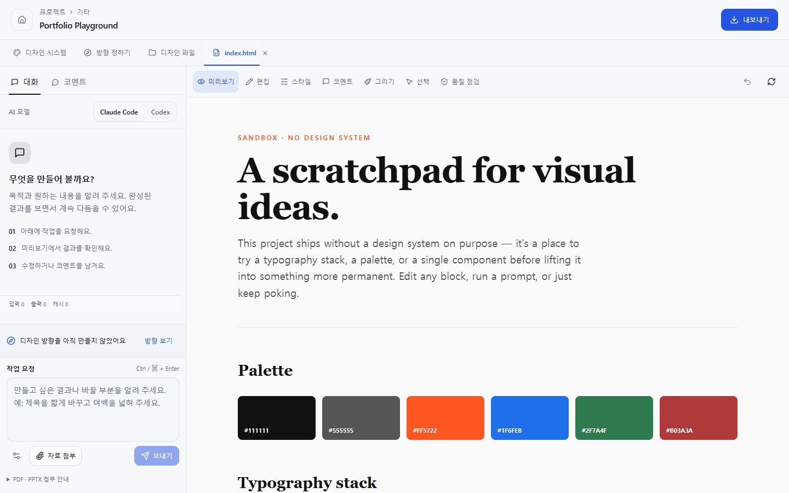
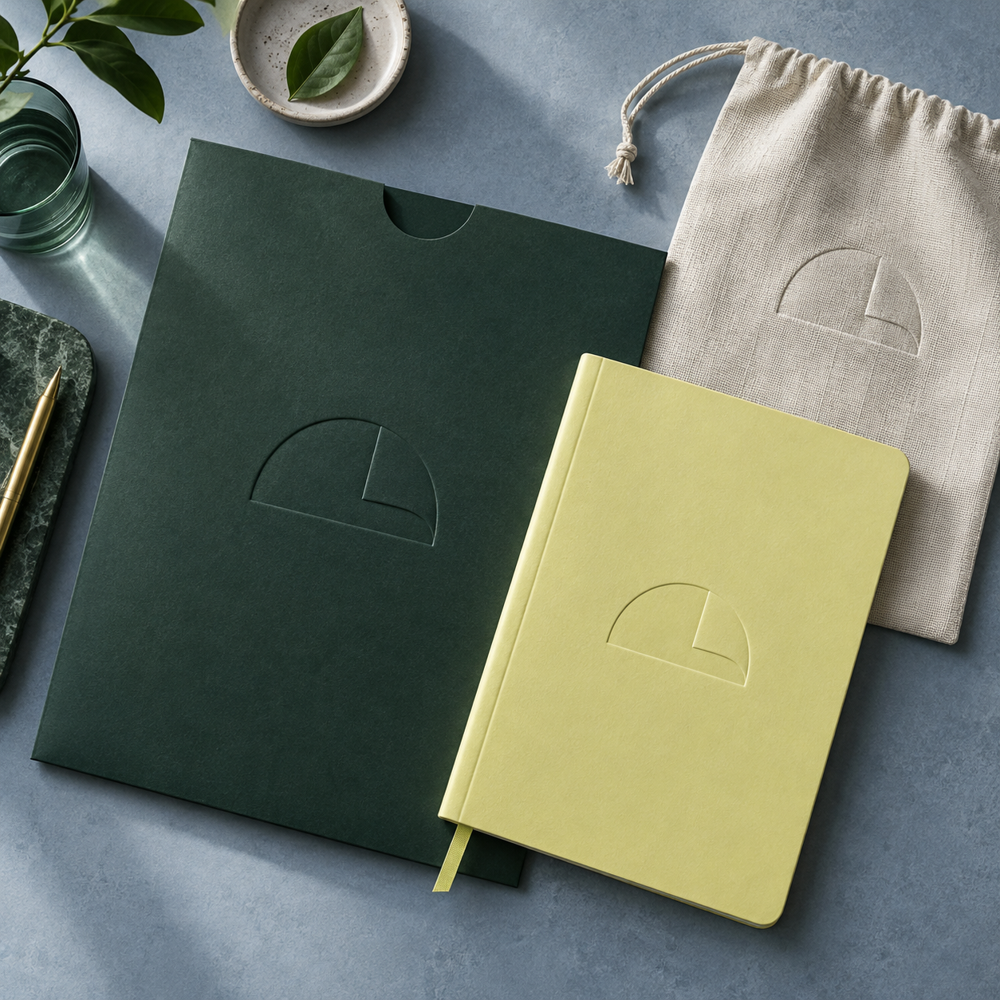
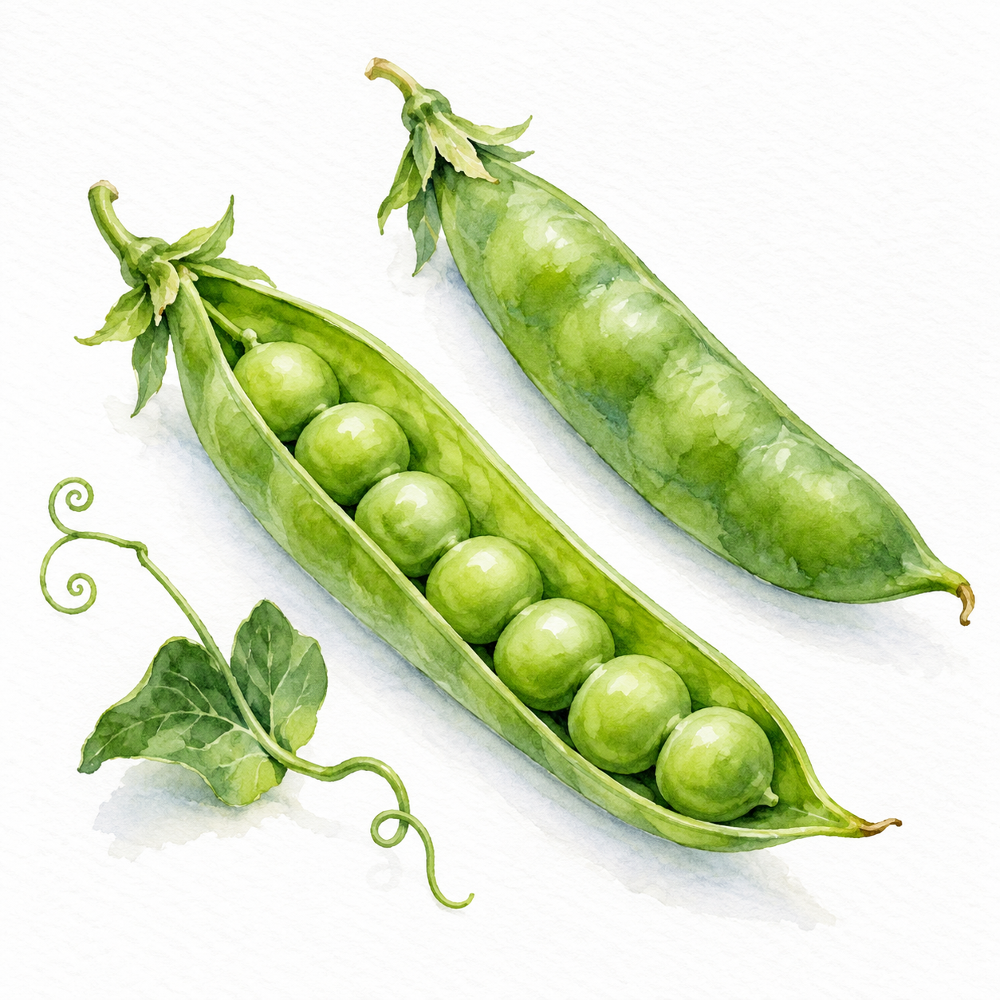
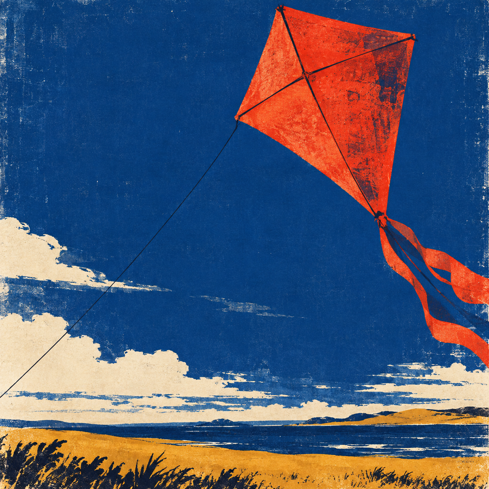
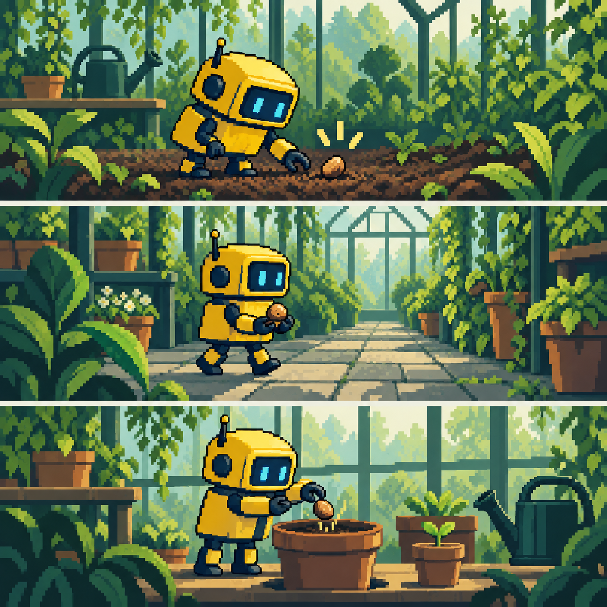

# BurnGuard

**说出想法，在画布上打磨，把文件带走。**

BurnGuard 是一个用于制作幻灯片、网站和平面作品的本地 AI 工作台，提供 Windows 和 macOS 原生应用。连接 Claude Code 或 Codex CLI，选择模型，在实时预览旁边完成工作。**默认使用 LOW 推理强度和原味模式。** 项目、附件和设计系统保存在你的电脑上，生成请求发送给你选定的服务商。

[English](README.md) · [한국어](README.ko.md) · [下载](https://github.com/ashmoonori-afk/BurnGuard/releases/latest) · [快速开始](#快速开始) · [文档](doc/README.md)


*在 v0.5.25 上使用 Claude Code（Sonnet，LOW 推理强度）且未选择设计系统录制。约五分钟的生成过程已加速，其余均为实时。*

> 本文档描述当前源码分支。已发布的桌面版可能只包含较早的功能集。封面为生成图片，工作区截图来自单独的示例配置。

## 能做什么

| 格式 | 工作流与产出 |
|---|---|
| 幻灯片 | 生成和编辑幻灯片，检查文案和排版，演示，或导出 HTML、PDF 和 PPTX。 |
| 网站 | 创建共享设计令牌、各页独立布局的多页站点。导出 HTML/CSS/JS/资源 ZIP，或发布到你的 Vercel 账户。 |
| 平面作品 | 设定画板尺寸，制作海报或多帧套图，导出 PNG、PNG 合集或 PDF。 |
| 商品详情页 | 制作带分区配图的长页面，按分区边界导出 PNG/JPEG 切片。 |
| 平台页面 | 导出 Cafe24 智能设计或 Imweb 代码组件包，附安装指南。安装需手动完成。 |
| 数据图表 | 创建面积图、折线图、柱状图、组合图、雷达图、饼图、径向图和桑基图。编辑数据、主题和颜色；HTML 中保留可移植的 SVG 和源数据。 |
| 3D 场景 | 添加并调整内置的 Three.js 对象，或请 AI 修改场景。 |

**导出限制：** HTML 和 PDF 保留渲染后的幻灯片设计。PPTX 把每页完整幻灯片保存为高分辨率图片，并把文字放进演讲者备注。单个元素在 HTML 工作区中编辑，不是 PowerPoint 对象。外部 API 和服务器功能仍需各自的服务。Cafe24/Imweb 组件包尚未在真实客户店铺中验证。

## 快速开始

### 桌面应用

从 [GitHub Releases](https://github.com/ashmoonori-afk/BurnGuard/releases/latest) 下载安装包。Windows 上运行安装程序，或解压便携版 ZIP 后打开 `BurnGuard.exe`。macOS 安装包未签名。两个桌面外壳共用同一个本地引擎，都支持基于发布源的更新；参见[安装、打包与更新指南](https://github.com/ashmoonori-afk/BurnGuard/releases/latest)。

| 功能 | 要求 |
|---|---|
| Windows 桌面版 | Windows 10/11 x64、.NET Framework 4.8 和 Microsoft Edge WebView2 Runtime |
| AI 生成 | 已安装并完成登录的 `claude` 或 `codex` CLI，以及你的服务商账户 |
| 平面作品生成 | 已登录的 Codex 连接；新的创意图片使用 Codex 图片生成 |
| 预览与导出渲染 | 受支持的 Chrome/Edge 或 Chromium；在设置中查看状态 |
| 读取附件 | PDF、PPTX、DOCX、TXT、MD、CSV 和受支持的图片；文档提取工具的要求显示在设置中 |

连接 AI 之前也可以浏览示例并编辑画布。扫描版 PDF 会保留原文件，但不保证自动 OCR。原味模式排除个人插件和指令，同时保留 BurnGuard 的项目上下文。CommandCode 路由使用在设置中输入的密钥，仍然需要 Claude Code CLI。

设置中还有两项值得了解：

- **界面语言**（设置 > 外观）：韩语、英语或简体中文。切换立即生效，只影响应用界面，并作为本地偏好保存；用户输入、AI 回复、生成结果、项目和文件名都不会被翻译。韩语仍是首次启动的默认语言。
- **Gemini、DeepSeek、Grok 连接**：目前只能保存 API 密钥。这些连接尚未接入生成，保存了密钥也不代表已通过认证或已连通。实际生成仍依赖 Claude Code 或 Codex CLI。

### 从源码运行

```powershell
git clone https://github.com/ashmoonori-afk/BurnGuard.git
cd BurnGuard
bun install --frozen-lockfile
bun run scripts/dev-launcher.ts
```

请使用 CI 固定的 Bun 1.3.14。启动器在 `http://127.0.0.1:5173` 打开前端，后端绑定到 `127.0.0.1:14070`。按 Ctrl+C 停止。若端口被占用，先确认占用的进程，再启动新实例。

Windows 上可用 `Start-BurnGuard.bat` 打开原生应用，首次启动时会自动构建；该构建需要 Bun 和 .NET 8 SDK。修改源码后请运行 `Start-BurnGuard.bat --rebuild`。[开发与原生构建](doc/CONTRIBUTING.md)。

## 在结果旁边工作

1. **开始或导入。** 选择格式/模板并上传素材，或导入已导出的 HTML 项目 ZIP。导入时会自动读取现有 HTML/CSS 的有限清单，并把受支持的文档提取到下一次 AI 上下文中。附件原件保存在项目的 `docs/attachments` 下，发布网站时会被排除。
2. **设定方向。** 从 21 种图片表现风格和横跨 13 个领域的 38 条用途配方中选择，或让每张图片按自身角色自动匹配配方。设定文案语气、模型和推理强度。[图片制作指南](doc/image-production.md)。
3. **生成。** 请求运行时，在画布上跟踪变化。回来时，会话草稿和素材附件仍然可用。
4. **打磨。** 选中元素即可缩放或旋转。字体和间距用高级面板，颜色用调色板，定向的 AI 修改用评论。使用平移控件移动画布，按 Ctrl/Cmd + 滚轮缩放。在已加载的画布上按 Control+Space，评论编辑器会直接在指针旁边打开，不切换画布模式；按 Escape 关闭并保存草稿。
5. **审查并导出。** 质量和 UX 检查会给出建议，并提供 AI 修复操作。通过与否不会阻止导出或发布；文件安全和请求权限检查仍然生效。

在对话输入框中直接粘贴剪贴板图片，即可作为附件加入；粘贴文字不受影响。



### 图表

打开 HTML 文件，在画布缩放/3D 控件旁选择**图表**。从八种类型中选一种，用你的数据替换明确标出的示例数据，然后保存。可以从电子表格粘贴制表符分隔的行：第一行是类别和系列名称，后面每行是数值。桑基图使用来源、目标和数值三列。

- 用已保存图表选择器编辑文件中的任意图表。保存以当前文件版本为准，支持多步撤销。在工作区按 Ctrl/Cmd+Z，或在保存历史中选择一个保留的项目版本。文本框保留原生撤销；绘图有自己的本地历史。
- 选择主题、来源、单位和颜色；在高级面板中调整尺寸。组合图允许每个系列分别使用柱、线或面积。
- 请 AI 在目标页面/幻灯片位置创建图表，或先保存一个，再从图表面板发送布局/数据请求。
- 图表保留 JSON 数据、内联 SVG、原生悬停提示和可访问的数据表。HTML 无需图表脚本或 CDN 即可显示。PNG/PDF 捕获的是渲染后的 SVG，不是可编辑的数据图表格式。

渲染器为原创实现，没有额外的图表库依赖。[图表数据契约、限制与示例](doc/charts.md)。

### 设计系统与示例

**21 个原创图片示例覆盖全部视觉风格和 13 个用途领域。** 每个示例把一种风格与图片的用途搭配起来；它们是生成的创意示例，不是应用截图。[完整画廊与精确提示词](doc/images/image-recipes/README.md)。

| 品牌 · 识别 | 水彩 · 学习 | 印刷 · 活动 |
|---|---|---|
|  |  |  |
| 黏土 · 收藏品 | 闪光 · 运动 | 像素 · 连续场景 |
|  |  |  |

可从 **SONNEL**（触感音响）、**FOLIOVER**（材质日志）、**ODDWARD**（实验工作室）或 **VELUNE**（雕塑灯具）开始。每套原创合集都包含网站、六页幻灯片、平面作品和设计系统。[浏览合集](samples/original/README.md)。

本地打包了 72 个字体家族：71 个 Google Fonts 家族加上 Pretendard，各自附带许可证声明。样式面板也可以按需加载系统已安装的字体；本地字体文件不会自动嵌入导出结果。[字体目录](assets/fonts/README.md)。

把受支持的文件、URL 或 Figma 来源导入设计系统。Pinterest 情绪板导入最多接受 12 个公开 Pin 链接，并区分采样得到的颜色与推断的情绪和备用字体。在项目中使用之前，先审查再发布该系统。

### 分享网站

选择**分享 → 准备当前产出**，输入 Vercel 令牌和可选的团队 ID，再选择**公开发布**。部署状态变为 READY 后复制链接。质量检查结果仅供参考。在对话框中输入的令牌只保存在内存中，对话框关闭或部署就绪后即清除。若在设置中保存令牌，它只存放在本机的本地配置文件中，之后可一键发布。托管费用、套餐资格和访客访问权限取决于你的 Vercel 账户设置；发布前请在 Vercel 中确认。

## 本地数据与安全

默认配置目录是 `~/.burnguard`（Windows 上为 `%USERPROFILE%\.burnguard`），包含 SQLite 数据库、项目、设计系统、设置和导出缓存。替换应用包时不要删除它。

本地存储不等于离线生成：选定的上下文会发送给你在 CLI 中配置的服务商。导入和发布也会使用网络。服务器绑定到回环地址，校验启动能力和 Host/Origin，并把生成的页面隔离在沙箱中。不要把本地服务器暴露到互联网。[安全模型](doc/01-architecture.md#7-security-and-safety-model)。

## 开发

| 包 | 职责 |
|---|---|
| `packages/frontend` | React 18/Vite 界面、对话、画布和设置 |
| `packages/backend` | Bun/Hono、SQLite、生成、持久化文件和导出 |
| `packages/shared` | 版本化契约、校验和可移植的图表渲染 |
| `packages/desktop-windows` | WinForms/WebView2 外壳与更新 |
| `packages/desktop-mac` | AppKit/WKWebView 外壳与更新 |

```powershell
bun run typecheck
bun run check:whitespace
bun run build:frontend
bun test
# 聚焦的图表校验与独立的浏览器检查：
bun test packages/backend/tests/charts.test.ts
node scripts/qa/e2e-smoke.mjs --only creation-canvas-charts
```

请在仓库根目录运行测试，这样预加载脚本才会创建隔离的临时配置目录。浏览器 QA 需要 Node.js 22.13+ 和 Chrome/Edge；Windows 上如有需要可传入 `--bun <bun.exe 的绝对路径>`。它使用自有的固定配置，不会向真实服务商发送请求。覆盖率（`bun run test:coverage`）是独立于测试通过的另一道门槛。每次发布前，由 GPT-5.6 或更高版本模型按既有 Daybreak 审查流程独立检查最终源码和安装包，并验证阻断级安全问题的修复。

## 更新日志

### 0.5.28

- 使用提取的设计系统新建的网站项目现在从基于 class 的页面骨架开始，保留提取的主视觉图片，并为按钮、副标题和页脚文字选择易读的颜色。已编辑过的页面不会被起始模板覆盖。
- 质量审查会逐个区块与参考截图比较，并裁出差异最大的区块，让修复可以一次只改一个区块。每张参考截图旁还会保存一张区块轮廓图。
- 网站提取更准确：副标题、品牌名、颜色令牌和主视觉图片的测量更可靠，抓取的 SVG 图片会被清理，样式表重定向只允许在同一站点内，并会记录无法测量布局的原因。
- 未安装 AI 工具时，发送按钮会被禁用并显示原因和设置链接。已停止或失败的回合总会如实显示；在另一回合运行时发送的消息会被干净地拒绝，不会留下记录了一半的回合。
- BurnGuard 在后台重启时，已打开的窗口会提示并提供重新加载。工作区、画布工具和导出在手机宽度下也可使用。
- 在模型支持时，推理强度默认为 medium；Claude、Gemini 和预设模型列表已更新为当前官方模型 ID。
- 画布只加载页面用到的字体，并在页面绘制完成前显示渲染中状态。样式侧边编辑器会保留你输入的值。
- 导出非常大或特殊的项目文件时更快、更安全，保留 macOS 上带重音字符的文件名，并正确编码下载文件名。
- 错误信息不再显示私有文件路径或原始系统错误文本，设置中的错误会说明如何恢复，并补全了韩语和中文文案。
- macOS 应用遵循与 Windows 应用相同的桌面规则，更新检查会正确比较预发布版本的顺序。

### 0.5.27

- 项目可导出为便携的 `.burnguard-project` 包并在另一台电脑上恢复。不包含已保存的服务商与访问令牌以及本地配置，恢复时总是创建新项目。
- 交接导出新增机器可读的清单、`HANDOFF.md` 和面向编程 CLI 的提示词，并提供可复制的命令，在 Claude Code 或 Codex 中继续工作。
- 设置 > 运行时诊断列出每个 CLI 连接的版本与能力，以及最近生成停止的阶段；失败或中断的项目可以从已保存的文件继续。
- 视觉质量指引覆盖网站、演示文稿、图形、标志和图表。质量面板新增建议性检查：分隔破折号、占位文案、眉标、重复或换行的主要行动按钮、强调色与圆角数量、相邻区块重复布局，以及面向网站的渲染旅程检查：无法跳转的链接、横向滚动的移动端导航、不可见的键盘焦点、加载时的布局偏移。
- 支持 GIF 附件，元数据中嵌有 SVG 文本的图片现在也能解码。WebP 在解码前校验容器，不受信任图片的取色在独立进程中运行。
- 可为设计生成 2 到 4 个视觉备选方案，并排比较，采用其中一个并删除其余。
- PDF、PNG、PNG ZIP 与 PPTX 导出后显示与画布的逐页相似度。该检查只提示，从不阻止下载。
- 可导入 Figma JSON 导出（可附帧图片），作为与设计系统令牌匹配的不可变参考，无需 Figma 账号令牌。
- 网站设计系统按页面提取（导航、页脚、站点地图，遵守 robots.txt），记录测量的布局、页面颜色、字体角色、素材使用规则和生成提示词。有 Chromium 时，会离线渲染最多四个源页面，在桌面与移动宽度下测量，并随设计系统保存参考截图。
- 使用提取的设计系统生成网站时，会把测量值作为硬性约束，提供起始样式表与页面骨架，以参考截图作为视觉目标，并给出唯一明确的优先级；审查阶段会对照测量布局检查页面并修复一次。
- 生成指引按模型系列的能力档案（claude-frontier、gpt-image、standard）调整。使用 Claude Opus 或 Sonnet 且未提供标志时，BurnGuard 按七条构成规则用设计令牌制作 CSS 与 SVG 标志，并在 Openverse 与 Iconify（无需密钥）上查找开放许可的照片、插画和图标来代替生成图片，同时保存来源与许可。Codex 上的 GPT 模型仍自行生成图片。可在设置中关闭网络搜索，模型选择器建议使用 medium 或更高的推理强度。
- 生成与修复提示词加入证据规则：视觉判断只依据渲染结果，未运行的检查报告为未验证，不写未测量的数字。
- 首次运行时跟随系统语言（韩语、简体中文，其余为英语），在设置中选择的语言始终优先。首次成功导出或发布后，应用只会询问一次是否为 GitHub 项目加星，不会发送任何信息。

### 0.5.26

- 将网站项目发布到 Vercel 时，只在公开站点上添加一个小小的"Made with BurnGuard"徽章；下载的 ZIP 保持不变，可在设置中或每次发布时关闭。
- 可以把 Vercel 令牌保存在本机，一键即可发布。设置页只显示是否已保存令牌，从不显示令牌本身。
- README 开头新增真实录制的演示：一句提示词生成落地页。
- 不受信任的设计系统源中隐藏的 `<template>` 和 `<noscript>` 标记现在每个容器只校验一次，嵌套超过八层即被拒绝，恶意构造的标记无法再拖住后端。
- macOS 发布冒烟测试改为通过图标而非工具栏位置查找画布"编辑"按钮，以适配 0.5.25 移除"选择"模式后的工具栏。

### 0.5.25

- 即使无法运行渲染设计检查（未安装 Chromium 或大型站点超时），生成回合也会提交，聊天中显示"审查未完成"徽章而不是拒绝该回合。必须修复的问题只在本回合修改过的页面上阻止提交；修改共享 CSS、脚本或图片的回合会检查所有页面。
- 质量面板将不适用于幻灯片和固定尺寸图形的检查标记为"不适用"，测量纯渐变的对比度，将等宽字体视为独立角色，扫描外链样式表中的硬编码颜色，并标记导出时无法获取的远程字体、图片和框架。
- 设计简报跟随应用语言；UX 审查结果、质量/平台修复请求、方向预览以及应用生成的所有 AI 请求均以韩文、英文或中文显示。服务器的每个错误代码都有对应提示。
- 提示词框架理顺了相互矛盾的规则（图表、调色板、断点、社会证明、地图嵌入、仅 Windows 的 PowerShell），新增韩文排版规则，在每个项目内准备 Lucide 图标参考，按请求加入 3D 和图表约定，提供完整的设计系统令牌块，并在精简模式下缩减固定规则。
- 画布：编辑面板可修改图片来源和链接目标，已解决的评论可重新打开，新评论直接打开编辑器，Ctrl/⌘+Z 可撤销样式调整，色板来自页面自身的令牌，列出全部内置字体，并移除了重复的选择模式。
- 主页与设置：深色模式在所有页面生效，语言点击即保存，后端检测失败时可重试，创建成功后清除草稿，搜索覆盖所有项目。
- 网站导入改为移除脚本和表单而非拒绝页面，为提取的令牌记录媒体查询上下文，并生成标准令牌契约；起始模板声明 `--page-background`。

### 0.5.24

- 新项目和内置示例重新可以在画布、实时预览和演示中打开；此前内置字体数量超过了画布字体上限，导致加载失败。
- PDF 和 PNG 压缩包导出保留作者编写的网格/弹性布局和页面背景，并等待延迟加载的图片；内置示例图形也可导出为画板 PDF。超出 PDF 上限的幻灯片会在渲染前说明原因并拒绝。
- Cafe24 和 Imweb 套件接受普通链接，包含所有页面及仅子页面使用的资源，页脚脚本可正常运行，并附带字体许可证；生成套件不再需要 Chromium。
- 导出只包含文档实际使用的内置字体，ZIP 条目使用本地时间，删除项目后不再残留导出缓存。
- 对话会准确显示本轮结果是否真正写入项目（包括幻灯片审校或修复失败）；按需将附件原始页面与幻灯片一一对应。
- macOS 应用：可找到通过 Homebrew 或 `~/.local/bin` 安装的 CLI 和 Python，在浏览器中打开外部链接，支持 ⌘C/⌘V/⌘Q 等标准快捷键，可替换同名下载文件，并在本地服务停止后再退出。
- Windows 应用在可恢复的 WebView2 进程故障时不再退出，并能加载已安装字体。Linux 源码运行也能列出已安装字体；macOS 和 Linux 上每个配置目录只由一个后端使用。
- 设置拆分为共享配置和设备本地的凭据与策略。

### 0.5.23

- 徽标项目实时显示 Codex 图像结果，原样保留候选文件，按画板检查文字，并给出更明确的失败阶段。
- Windows 使用作业对象管理后端进程树，安全传递批处理方式的服务商参数，并按文件名处理原生下载。
- 发布打包前在 Windows 和 macOS 上验证原生画布、持久化和导出。

### 0.5.22

- 新增徽标设计项目：探索轮次、选定的 SVG 母版和品牌规范交付物。
- macOS：可用的沙盒画布、原生导出下载、已安装字体列表，以及用于 PDF 依赖的应用专属 Python 环境。
- 安全修复：解压前检查 PNG 解码尺寸、设计系统发布前重新验证 SVG、收紧 POSIX 包权限。
- 0.5.20 和 0.5.21 未公开发布。

### 0.5.19

- 修复旧开发版本的附件记录阻止服务器启动的问题，仅恢复经验证的记录，保留项目文件和上传原件。
- 读取设计系统规则时统一 Windows 换行符。
- 修复 Windows 浏览器测试启动和测试间干扰，并在 Windows 发布验证中加入旧记录恢复测试。

### 0.5.18

- 内容和图片加载时，将超出尺寸的幻灯片内容缩放到画板内。
- 完成前校验幻灯片内容、数量、运行时和本地图片；占位内容或未完成输出会继续生成。
- 默认生成写实图片，避免抽象装饰图像。
- 将 04–23 历史规格和 reference 笔记保留在本地，并整理公开文档目录。

### 0.5.17

- 按项目类型显示幻灯片或网站缩略图。
- 停止生成时保留已写入的 HTML 和资源；入口文件若在写入期间被删除，则恢复先前文件。
- 固定项目设计规则，检查渲染结果，并在交付导出中附带审核依据。

[全部版本](https://github.com/ashmoonori-afk/BurnGuard/releases)

## 文档与许可证

[文档索引](doc/README.md) · [架构](doc/01-architecture.md) · [设计系统](<design system sample/README.md>) · [生成指引](doc/design-craft.md) · [品牌识别](doc/brand-identity.md)

BurnGuard 采用 **Apache-2.0** 许可证。第三方声明见 [LICENSE](LICENSE) 和 [NOTICE](NOTICE)，图片和截图来源见[图片说明](doc/images/README.md)。
