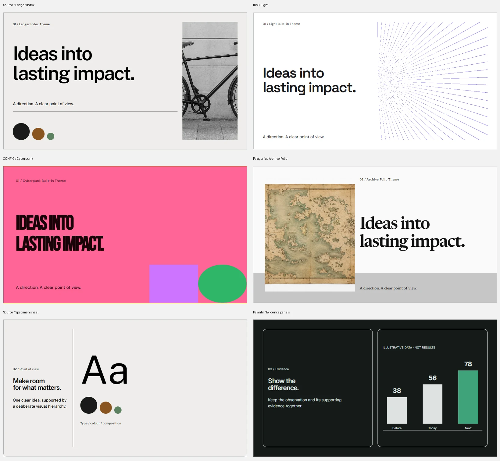

# Reference-driven slide systems

Implementation record, September 15, 2026. Supersedes the generic slide compositions in [22-design-system-surfaces-2026-09-15.md](./22-design-system-surfaces-2026-09-15.md) for the 41 bundled themes.

The supplied PDFs were inspected as rendered pages. Their layout principles are adapted to 1920 × 1080 presentation frames using each BurnGuard theme's own typography, palette and image direction. The PDFs, brand marks and original screenshots are not distributed. Printed report density is reduced by splitting claims across slides; it is not reproduced at unreadable scale.

## Reference assignment

| Reference | Themes | Structural reason |
|---|---|---|
| 164 — Perplexity Ads Pitch Deck | dark, signal-reel, signal-console | Cinematic claim, product proof and a narrow caption rail |
| 199 — Figma CONFIG2025 Conference Deck | cyberpunk, synthwave, night-marquee, stencil-field | Oversized type, geometric bands and speaker lineups |
| 197 — Holographik Quantum Spa Brand Guidelines | dracula, cobalt-atelier, linen-retreat | Atmospheric chapters alternating with precise specimen sheets |
| 181 — FREITAG Impact Report 2023 | blueprint-manual, graphite-spec, field-register | Visible construction grid and shared-edge report cells |
| 173 — IBM Cost of a Data Breach Report 2023 | light, nord, business, paper-instrument, quiet-runtime, index-table | Finding/chart/method columns and analytical whitespace |
| 172 — Zip Brand Guidelines | cupcake, studio-counter, market-stack | Unequal brand-colour planes and merchant specimens |
| 160 — Brand Guidelines by Source | ledger-index, facet-archive, vitrine-mono, exhibit-wall | Indexed instruction rail, oversized specimens and continuous fine rules |
| 127 — The RealReal Resale Report 2024 | luxury, dune-editorial, atelier-counter, quarterly-folio | Editorial portraits, product annotations and alternating image halves |
| 122 — Palantir Q4 2023 Deck | console-ledger, night-edition | Period bands, aligned result rows and paired analytical panels |
| 108 — Nike Impact Report FY23 | press-riso, long-form-press | Human photography alternating with prominent impact charts |
| 085 — Ace & Tate Responsibility Report 2020 | daylight-press, warm-vestibule | Organic chapter fields, editorial quotations and isolated impact figures |
| 068 — Burger King Brand Guidelines | retro, timber-hall | Stacked display titles and warm specimen sheets |
| 101 — Building a brand like Patagonia | archive-folio, wide-gutter-review, stone-court | Framed material imagery, unequal editorial halves and quotation spreads |

Inspected page numbers, cover/body/evidence/closing recipes and geometry live in [deck-references.ts](../packages/backend/src/data/deck-references.ts). Each theme belongs to exactly one reference family; the identity tokens and existing images make the adaptations theme-specific. The five original sample systems and Northvale keep their existing surface contracts.

## Generation and existing installations

`bun run surfaces` writes the theme's slide tokens and README section. The same bounded section reaches both compact and full generation prompts through the existing surface reader. It specifies a cover → claim → evidence → implication → closing sequence, with topic chapters for longer decks. Repeating a single body layout throughout is explicitly disallowed. Reference prose fits the existing 1,800-character section limit.

Installed systems with the exact shipped v0.5.15 slide token set or slide section receive the corresponding current bundled values at read time. SHA-256 fingerprints identify those legacy defaults, with newline normalization for Windows. A changed local token set or section retains precedence. No managed files or content receipts are rewritten. Custom and derived system IDs are not treated as bundled originals.

The generator also normalizes CRLF before replacing its generated tail, preventing duplicate sections when regenerated from a Windows checkout. Website and content geometry remain unchanged.

## In-app review

The contact sheet combines six actual preview captures. Labels identify the structural reference and adapted BurnGuard theme; all imagery is existing BurnGuard artwork, not extracted PDF artwork.

Open a bundled design system and find **Slide compositions** in its previews. Each contains four authored specimens: cover, body, evidence and closing, plus expandable composition guidance and reference provenance. The previews use existing BurnGuard-generated theme images, shared local fonts, and explicitly illustrative copy/data. They are layout examples, not a claim that a model generated a finished customer deck.

The existing authenticated preview route supplies `preview/slides.html` as a virtual fallback. Existing authored files retain precedence. The iframe continues to disable scripts; relative image/font resources use the existing resource map. No new external service, source PDF or screenshot is required at runtime.

Source's overview principles also appear in the design-system window: a large title, restrained rules, numbered section labels in a narrow left rail, and larger preview specimens to the right. The rail stacks above the specimen at narrow widths. Existing edit, publish, colour and font controls retain their behavior.

## Validation

Thirty focused regression tests passed, covering all 41 assignments, complete untruncated generated sections, the four preview frames, virtual resources, old-install upgrades under LF/CRLF, and preservation of local edits. Typecheck, lint and the frontend/backend build passed. Chrome checked 41 themes at desktop and mobile viewport sizes (82 cases, four frames each): no page errors, broken images, horizontal overflow or visible text outside the slide frame. Six representative systems also received full four-frame captures and visual inspection. These authored preview checks do not substitute for a live model-quality comparison.
